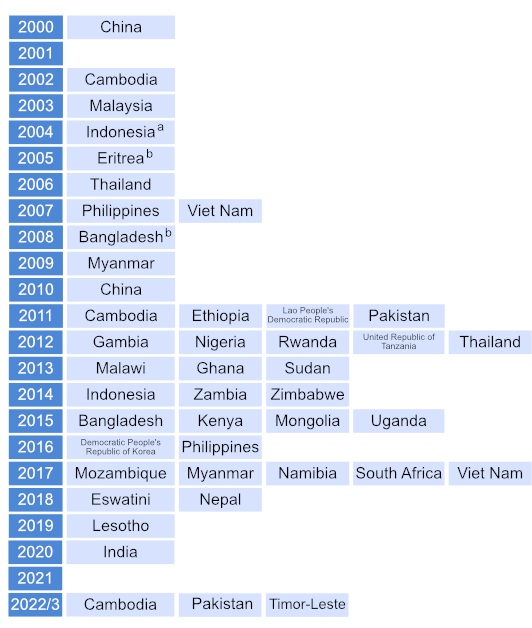

--- 
title: "Section 2.4 TB prevalence surveys " 
author: "Irwin Law, with some tweaks by Hazim Timimi" 
date: "`r Sys.Date()`" 
knit: (function(inputFile, encoding) {
      out_dir <- "./html_drafts";
      rmarkdown::render(inputFile,
                        encoding=encoding,
                        output_dir=file.path(dirname(inputFile), out_dir))})
output:  
  html_fragment:
    # Don’t include a table of contents
    toc: no
    # Set standard figure width to 12 inches
    fig_width: 12
    # Don’t write figure captions
    fig_caption: FALSE
    # Don't embed external resources (stylesheets, JS libraries) in the output 
    self_contained: FALSE

# Note:
# 
# To create the file with embedded png images for copying to SF set self_contained: TRUE and then 
# comment out lines 128 to 135 so that the Bootstrap, JQuery and Kendo files aren't also embedded

# To run this file and store output as html:
# rmarkdown::render(here::here("report/ch2-4.rmd"), output_file = "ch2-4.html", output_dir = here::here("report/html_drafts/")) 
--- 

```{r echo=FALSE, message=FALSE, warning=FALSE, paged.print=FALSE,  fig.align = "center"}


library(dplyr)
library(ggplot2)
library(tidyverse)
library(tidyr)
library(RColorBrewer)
library(whomap)
library(gtbreport)
library(jsonlite)
library(here)

# Set datestamp of CSV file to use ----
# - - - - - - - - - - - - - - - - - - - - - - - - - - - - - - - - - -
csv_datestamp <- '2022-08-29'
prev_notif_csv_datestamp <- '2022-06-23'


# Load TB data (CSV,not rda because the latter are datatables ...) ----
# - - - - - - - - - - - - - - - - - - - - - - - - - - - - - - - - - -

# Function to read in timestamped CSV file and to undo Philippe's conversion of underscores to dots
get_timestamped_csv <- function(csv_filename_stub, timestamp) {
  df <- read.csv(here(paste0('csv/', csv_filename_stub, '_', timestamp,'.csv')))
  names(df) <- gsub('[.]', '_', names(df))
  return(df)
}

# make sure Namibia's iso2 code is not interpreted as R's NA (null)
fix_namibia <- function(df){
  df$iso2 <- ifelse(df$country=="Namibia", "NA", as.character(df$iso2))
  return(df)
}

country  <- get_timestamped_csv('cty', csv_datestamp) %>% fix_namibia()
prev <- get_timestamped_csv('prev', csv_datestamp)  %>% fix_namibia()

prev_notif <- get_timestamped_csv('prev_notif', prev_notif_csv_datestamp)  %>% fix_namibia()


# Add simple function to convert NA to zero
NZ <- function(x) {
  ifelse(is.na(x),
         0,
         x)
}


# Quick function for callouts in the text to the figures/tables:

# Quick functions for callouts in the text to the figures/tables:
# - - - - - - - - - - - - - - - - - - - - - - - - - - - - - - - - - - - 

# 1. lnk() Creates a link from text to a named anchor)
lnk <- function(display_name){
  return(paste0('<span class="red">[', 
                display_name, 
                '](#', 
                gsub("[^a-zA-Z0-9]", "-", tolower(display_name)),
                ')</span>'))
}
# 2. anch() creates the named anchor to go above the figure or table
anch <- function(display_name){
  return(paste0('<a name="', 
                gsub("[^a-zA-Z0-9]", "-", tolower(display_name)),
                '"></a>'))
}
# 3. ref_lnk() creates a link from text to the references in the WHO style (black, italic)
ref_lnk <- function(display_name){
  return(paste0('<span class="refs">[', 
                display_name, 
                '](#refs)</span>'))
}


```

```{css, echo=FALSE}

/* Styles to make it easier to see in the html_fragment; this CSS can be included in the CSS widget of Sitefinity */

.subhead, .footnote {
  font-size: 80%;
  line-height: 100%;
  font-weight: normal;
  margin: 0;
  padding: 0;
}

.subhead {
	margin-top: -15px; /* Bring subheadings closer to figure headings */
}

.red, .red a {
  color: #F21905; /* red text to show figure number */
}


.refs, .refs a {
  color: #3c4245;  /* match SF normal text colour */
  font-style: italic;
}

```
<!-- Add links to stylesheets, JQuery and Kendo UI  -->

<link rel="stylesheet" href="https://kendo.cdn.telerik.com/2022.1.301/styles/kendo.common.min.css" />
<link rel="stylesheet" href="https://kendo.cdn.telerik.com/2022.1.301/styles/kendo.default.min.css" />
<link rel="stylesheet" href="https://kendo.cdn.telerik.com/2022.1.301/styles/kendo.default.mobile.min.css" />
<link rel="stylesheet" href="https://maxcdn.bootstrapcdn.com/bootstrap/3.4.1/css/bootstrap.min.css">

<script src="https://kendo.cdn.telerik.com/2022.1.301/js/jquery.min.js"></script>
<script src="https://kendo.cdn.telerik.com/2022.1.301/js/kendo.all.min.js"></script>
<script src="https://docs.telerik.com/kendo-ui/assets/bootstrap.min.js"></script>

<!-- End of links section -->

# 2.4 National TB prevalence surveys

_Draft! Prepared `r Sys.Date()` using prevalence survey results from the database files dated `r csv_datestamp` and Irwin's prevalence:notification CSV file dated `r prev_notif_csv_datestamp`_


## Rationale: why are surveys needed? 

To reliably track the burden of tuberculosis (TB) disease in terms of TB incidence and TB mortality from subnational to global levels, the ultimate goal is that all countries can rely on data routinely collected through national disease surveillance and vital registration (VR) systems. 

Currently, all countries have national systems for notification (i.e. reporting) of TB cases and most report national notification data to the World Health Organization (WHO) on an annual basis (<span class="red">Section 3</span>). However, in many countries (including most high TB burden countries) the number of notified cases each year is not a good proxy for the actual number of people who develop TB disease, for two reasons. The first is underreporting of people diagnosed with TB, especially in countries with large private sectors or in which people with TB seek care in public facilities that are not linked to the national TB programme and its associated reporting systems. The second is underdiagnosis, especially in countries with geographic or financial barriers to seeking health care. Many countries (including most high TB burden countries) do not have established national VR systems of high quality and coverage that can be used to reliably monitor the number of deaths and their cause (`r ref_lnk("1")`). 

In countries with a relatively high burden of TB disease that do not yet have national disease notification and VR systems of sufficiently high quality and coverage, national TB prevalence surveys are the best way to directly measure the burden of TB disease in the population (`r ref_lnk("2, 3, 4")`). In terms of disease burden, WHO currently recommends consideration of surveys in countries with an estimated TB incidence of 150 per 100 000 population per year (`r ref_lnk("3, 4")`).  


## What is measured in a survey? 

National TB prevalence surveys can provide a reliable measurement of the number of people in the population with bacteriologically confirmed pulmonary TB at a given point in time, and the distribution of these cases by age and sex. In addition, repeat surveys allow assessment of trends, and of the impact of interventions to reduce the burden of disease in the period since the last survey. WHO recommends that surveys focus on people aged 15 years or over (`r ref_lnk("2")`).  


## How can survey results be used? 

Results can be used to inform national estimates of TB incidence in all age groups, and can thus help to track progress towards the milestones and targets for reductions in TB incidence set in the End TB Strategy (<span class="red">Section 2.1</span>, <span class="red">Fig. 2.1.10</span>). Previously, survey results were also important for the assessment of progress towards global, regional and national targets for reductions in TB prevalence between 1990 and 2015. 

For these reasons, the implementation of national TB prevalence surveys in 22 priority countries (referred to as global focus countries, GFCs) was one of three strategic areas of work defined by the WHO Global Task Force on TB Impact Measurement (the Task Force) for the period 2007-2015 (`r ref_lnk("2, 3")`). National TB prevalence surveys were retained within the Task Force's updated strategic areas of work after 2015 (`r ref_lnk("4, 5")`). 

Other benefits of prevalence surveys include that they can be used to document health care seeking behaviour in the public and private sectors, assess variation in underreporting or underdiagnosis of TB by age and sex (using the ratio of prevalence to notifications), and quantify the extent of underreporting of people diagnosed with TB to national authorities. Findings can help to inform the development or improvement of TB case finding, diagnosis and treatment interventions. 

## Status of progress 

Between 2000 and the end of 2021, a total of 41 national TB prevalence surveys in 33 countries were implemented. They included repeat surveys in China, Cambodia, Myanmar, the Philippines and Viet Nam that used screening and diagnostic methods recommended by WHO (`r ref_lnk("2")`) (`r lnk("Fig. 2.4.1")`).These 33 countries comprised 18 in Africa and 23 in Asia, and 20 of the 22 GFCs.


### `r anch("Fig. 2.4.1")`<span class="red">Fig. 2.4.1</span> National surveys of the prevalence of TB disease, actual (2000&#8211;2021) and planned (2022&#8211;2023) 
<div class="subhead">The year in which most field operations were implemented is shown.</div> 



<div class="footnote">^a^ The survey in Indonesia (2004) did not use chest X-ray to screen individuals for
sputum submission.<br>
^b^ The surveys in Bangladesh (2008) and Eritrea (2005) collected sputum samples
from all individuals (aged &#8805; 15 years), and did not use chest X-ray and/or a
symptom questionnaire to screen individuals for sputum submission.<br>
</div>


<br />
Repeat surveys are in the planning stages in 2022-2023 in Cambodia and Pakistan and a first survey is planned for Timor-Leste (`r lnk("Fig. 2.4.2")`). In 2019-2021, the first-ever national survey was completed in India; this was one of the largest surveys to date, with a sample size of about 320 000 people.

### `r anch("Fig. 2.4.2")`<span class="red">Fig. 2.4.2</span> Countries in which national population-based surveys of the prevalence of TB disease have been implemented using currently recommended screening and diagnostic methods since 2000 or are planned (status in August 2022) ^a^
```{r fig_2.4.2, echo=FALSE, message=FALSE, warning=FALSE, results = "asis", dev = 'png',  fig.alt="Map of countries involved in national TB prevalence surveys"}

#```{r echo=FALSE, message=FALSE, warning=FALSE, results = "asis", dev = 'png', fig.height=7 }

tbps <- prev %>%
  select(country, year, iso3)%>%
  filter(year>2006)%>%
  group_by(country) %>%
  filter(year == max(year))%>%
  arrange(year, country)

df1<- data.frame(
    country = I(c("Cambodia", "Pakistan", "Timor-Leste", "China","Myanmar","Thailand","Philippines","Viet Nam", "India")),
    var = c("Repeat survey planned", "Repeat survey planned", "Repeat survey planned", "rpt", "rpt", "rpt", "rpt", "rpt","One survey completed"),
iso3=c("KHM", "PAK", "TLS", "CHN","MMR","THA","PHL","VNM", "IND"))

df1$var <- str_replace(df1$var, "rpt", "\u22652 surveys completed")

f2_4_2_data <- merge(tbps, df1, all=TRUE)
f2_4_2_data[is.na(f2_4_2_data)] <- "One survey completed"

f2_4_2_plot <- whomap(f2_4_2_data, colours= c("#88be3b", "#308047","#Be4eb0"), na.col="#FFFFFF",  na.label = "No survey planned", water.col = "white") 

print(f2_4_2_plot)

#ggsave(here('report/html_drafts/f2.4.2.png'),width=8.3, height = 5.8)

```
 <div class="footnote"> ^a^ Screening methods include field chest X-ray; at least culture was used to confirm diagnosis. The most recent surveys in Bangladesh, Eswatini, Kenya, Lesotho, Myanmar, Mozambique, Namibia, Nepal, Philippines, South Africa and Viet Nam used both culture and Xpert MTB/RIF to confirm diagnosis. Survey planned: a country has submitted at least a draft survey protocol and a budget plan to the WHO Global Task Force on TB Impact Measurement. One survey completed: a survey that was conducted in accordance with WHO recommendations as outlined in _Tuberculosis prevalence surveys: a handbook (2011)_ and at least a preliminary report has been published, &#8805; two surveys completed: countries that have conducted at least two national surveys in which participants were screened with chest X-ray, and (at least) culture was used to diagnose TB cases.</div> 


## Survey findings and implications 

Surveys have showed that the estimated prevalence of bacteriologically confirmed pulmonary TB per 100 000 population aged 15 years or over was high in many countries, but there was also considerable variation (`r lnk("Fig. 2.4.3")`). 

### `r anch("Fig. 2.4.3")`<span class="red">Fig. 2.4.3</span> Estimates of the prevalence of bacteriologically confirmed pulmonary TB in surveys completed 2007-2021 ^a^
```{r  fig_2.4.3, echo=FALSE, message=FALSE, warning=FALSE, results = "asis", dev = 'png',  fig.alt="Map of countries involved in national TB prevalence surveys"}

f2_4_3_data <- prev  %>%
  filter(year >= 2006) %>%
  filter(year != 2008) %>% #this removes Bangladesh 2008 for now
  filter(case_type=="b") %>%
  filter(sex=="a") %>%
  filter(age_group=="15plus")%>%
  filter(area_type=="a")%>%
  
  # Get the region for each country
  inner_join(select(country, iso2, g_whoregion), by="iso2") %>% 
  
  # Identify Africa and Asia surveys
  mutate(region = ifelse(g_whoregion == "AFR", "Africa", "Asia")) %>% 
  
  # Tweak Sudan because it is in EMR not AFR!
  mutate(region = ifelse(iso2 == "SD", "Africa", region)) %>% 
  
  select(region, country, year, prev, prev_lo, prev_hi) %>%
  arrange(prev)
  
# Change labels of countries with multiple surveys
f2_4_3_data$country[f2_4_3_data$country == "Philippines" &  f2_4_3_data$year == 2007] <- "Philippines (2007)"
f2_4_3_data$country[f2_4_3_data$country == "Philippines" &  f2_4_3_data$year == 2016] <- "Philippines (2016)"

f2_4_3_data$country[f2_4_3_data$country == "Myanmar" &  f2_4_3_data$year == 2009] <- "Myanmar (2009)"
f2_4_3_data$country[f2_4_3_data$country == "Myanmar" &  f2_4_3_data$year == 2018] <- "Myanmar (2018)"

f2_4_3_data$country[f2_4_3_data$country == "Viet Nam" &  f2_4_3_data$year == 2007] <- "Viet Nam (2007)"
f2_4_3_data$country[f2_4_3_data$country == "Viet Nam" &  f2_4_3_data$year == 2018] <- "Viet Nam (2018)"


f2_4_3_plot <- qplot(prev, reorder(country, prev), data=f2_4_3_data, geom='point', size=I(3), colour=I('skyblue'), 
            fill=I('skyblue')) +
  geom_segment(aes(x=prev_lo, xend=prev_hi, y=country, yend=country), colour=I('skyblue'), size=I(4)) +
  
  geom_point(aes(prev, country), colour=I('skyblue'), size=I(5), pch=3) +
  
  facet_wrap(~region, nrow=1, scales='free_y') +
  
  scale_x_log10(breaks=c(100, 200, 500, 1000), labels=c("100","200","500","1000")) +
  
  xlab('Prevalence per 100 000 population (log scale)') + ylab('') +
  
  theme_gtb(base_size=11)

print(f2_4_3_plot)

#ggsave(here('report/html_drafts/f2.4.3.png'),width=8.3, height = 5.8)

```
<div class="row">
<div class="col-md-6">
<div id="fig_2_4_3_africa"></div>
</div>
<div class="col-md-6">
<div id="fig_2_4_3_asia"></div>
</div>
</div>

<div class="footnote"> ^a^ The measured prevalence of bacteriologically confirmed pulmonary TB was higher in the 2017 survey in Viet Nam compared with 2007. However, this was due to more diagnostic testing with more sensitive methods. When results based on the same method were compared, prevalence was estimated to have fallen between 2007 and 2017. Results from the national TB prevalence survey of India are not shown; these are currently under discussion between WHO and the National TB Elimination Programme of the Ministry of Health & Family Welfare, India.</div> 


<br />
In African countries, prevalence ranged from 119 (95% confidence interval [CI]: 79-160) per 100 000 population in Rwanda (in 2012) to 852 (95% CI: 679-1026) per 100 000 population in South Africa (in 2017). In Asian countries, prevalence ranged from 119 (95% CI: 103-135) per 100 000 population in China (in 2010) to 1159 (95% CI: 1016-1301) per 100 000 population in the Philippines (in 2016). 

In most Asian countries and some African countries, prevalence increased with age (`r lnk("Fig. 2.4.4")`, `r lnk("Fig. 2.4.5")`).

### `r anch("Fig. 2.4.4")`<span class="red">Fig. 2.4.4</span> Estimated age-specific prevalence of bacteriologically confirmed pulmonary TB for surveys implemented in Africa, 2010&#8211;2019 ^a^
<div class="subhead">The <span class="red">red</span> line denotes the best estimate and the <span style="color:#4ABAFC">blue</span> shaded areas are the 95% confidence intervals.</div> 

```{r fig_2.4.4, echo=FALSE, message=FALSE, warning=FALSE, results = "asis", dev = 'png', fig.height=10,  fig.alt="Panel plot of age-specific prevalence in African surveys"}

f2_4_4_and_5_data <- prev  %>%
  # Get the region for each country
  inner_join(select(country, iso2, g_whoregion), by="iso2") %>% 
  
  # Identify Africa and Asia surveys
  mutate(region = ifelse(g_whoregion == "AFR", "Africa", "Asia")) %>% 
  
  # Tweak Sudan because it is in EMR not AFR!
  mutate(region = ifelse(iso2 == "SD", "Africa", region)) %>% 
  
  # Restrict to detailed age groups for bac-confirmed cases (except for Tanzania, which should be smear-positives)
  filter(case_type == "b" | (case_type == "s" & iso2 == "TZ")) %>%
  filter(sex == "a") %>%
  filter(age_group!="15plus")%>%
  filter(age_group!="all") %>% 
  filter(year > 2006)
  
# Add codes for the age groups
f2_4_4_and_5_data$code[f2_4_4_and_5_data$age_group == "15_24"] <- 1
f2_4_4_and_5_data$code[f2_4_4_and_5_data$age_group == "25_34"] <- 2
f2_4_4_and_5_data$code[f2_4_4_and_5_data$age_group == "35_44"] <- 3
f2_4_4_and_5_data$code[f2_4_4_and_5_data$age_group == "45_54"] <- 4
f2_4_4_and_5_data$code[f2_4_4_and_5_data$age_group == "55_64"] <- 5
f2_4_4_and_5_data$code[f2_4_4_and_5_data$age_group == "65plus"] <- 6
f2_4_4_and_5_data$code[f2_4_4_and_5_data$age_group == "15_34"] <- 7
f2_4_4_and_5_data$code[f2_4_4_and_5_data$age_group == "35_54"] <- 8
f2_4_4_and_5_data$code[f2_4_4_and_5_data$age_group == "55plus"] <- 9


# Plot restricted to surveys in Africa
f2_4_4_data <- filter(f2_4_4_and_5_data, region == "Africa")

f2_4_4_plot <-   ggplot(data = f2_4_4_data, aes(x=code, y=prev)) +  
  
  geom_line(data = f2_4_4_data, aes(y = prev),colour = "#FC1C1E", size=1) +
  
  geom_ribbon(data = f2_4_4_data, aes(ymin = prev_lo, ymax = prev_hi),alpha = 0.5, fill="#CCE8FA") +
  
  facet_wrap(~country, nrow=5, scales="free",
             # Use the labeller function to make sure long country names are wrapped in panel headers
             labeller = label_wrap_gen(width = 25)) +
  
  scale_x_continuous(breaks = c(1,2,3,4,5,6,7,8,9),
                     labels=c("15-24","25-34","35-44","45-54","55-64","\u226565","15-34","35-54","\u226555")) + 
      
  ylab('Prevalence per 100 000 population') +
      
  xlab('Age groups (years)') +
  
  scale_y_continuous(expand = c(0, 0)) +
      
  theme_gtb()

print(f2_4_4_plot)

#ggsave(here('report/html_drafts/f2.4.4.png'),width=8.3, height = 5.8)

```

<div class="row">
<div class="col-md-4">
<div id="fig_2_4_4_SWZ"></div>
</div>
<div class="col-md-4">
<div id="fig_2_4_4_ETH"></div>
</div>
<div class="col-md-4">
<div id="fig_2_4_4_GMB"></div>
</div>
</div>

<div class="row">
<div class="col-md-4">
<div id="fig_2_4_4_GHA"></div>
</div>
<div class="col-md-4">
<div id="fig_2_4_4_KEN"></div>
</div>
<div class="col-md-4">
<div id="fig_2_4_4_LSO"></div>
</div>
</div>

<div class="row">
<div class="col-md-4">
<div id="fig_2_4_4_MWI"></div>
</div>
<div class="col-md-4">
<div id="fig_2_4_4_MOZ"></div>
</div>
<div class="col-md-4">
<div id="fig_2_4_4_NAM"></div>
</div>
</div>

<div class="row">
<div class="col-md-4">
<div id="fig_2_4_4_NGA"></div>
</div>
<div class="col-md-4">
<div id="fig_2_4_4_RWA"></div>
</div>
<div class="col-md-4">
<div id="fig_2_4_4_ZAF"></div>
</div>
</div>

<div class="row">
<div class="col-md-4">
<div id="fig_2_4_4_SDN"></div>
</div>
<div class="col-md-4">
<div id="fig_2_4_4_UGA"></div>
</div>
<div class="col-md-4">
<div id="fig_2_4_4_TZA"></div>
</div>
</div>

<div class="row">
<div class="col-md-4">
<div id="fig_2_4_4_ZMB"></div>
</div>
<div class="col-md-4">
<div id="fig_2_4_4_ZWE"></div>
</div>
<div class="col-md-4"></div>
</div>

<div class="footnote"> ^a^ Surveys in Gambia and Rwanda were restricted to only three age group categories because the number of survey cases was low. Bacteriologically confirmed TB cases could not be verified for United Republic of Tanzania, so smear-positive TB prevalence rates are shown instead.</div> 

### `r anch("Fig. 2.4.5")`<span class="red">Fig. 2.4.5</span> Estimated age-specific prevalence of bacteriologically confirmed pulmonary TB for surveys implemented in Asia, 2007&#8211;2021 ^a^  
```{r fig_2.4.5, echo=FALSE, message=FALSE, warning=FALSE, results = "asis", dev = 'png', fig.height=12,  fig.alt="Panel plot of age-specific prevalence in Asian surveys"}

# Filter on Asian surveys
f2_4_5_data <- filter(f2_4_4_and_5_data, region == "Asia")

f2_4_5_data <- within(f2_4_5_data, country[country == 'Viet Nam' & year == 2007] <- 'Viet Nam (2006-2007)')
f2_4_5_data <- within(f2_4_5_data, country[country == 'Viet Nam' & year == 2018] <- 'Viet Nam (2018)')

f2_4_5_data <- within(f2_4_5_data, country[country == 'Philippines' & year == 2007] <- 'Philippines (2007)')
f2_4_5_data <- within(f2_4_5_data, country[country == 'Philippines' & year == 2016] <- 'Philippines (2016)')

f2_4_5_data <- within(f2_4_5_data, country[country == 'Myanmar' & year == 2009] <- 'Myanmar (2009-2010)')
f2_4_5_data <- within(f2_4_5_data, country[country == 'Myanmar' & year == 2018] <- 'Myanmar (2018)')


f2_4_5_plot <-ggplot(data = f2_4_5_data, aes(x=code, y=prev)) +  
  
  geom_line(data = f2_4_5_data,aes(y = prev),colour = "#FC1C1E", size=1) +
      
  geom_ribbon(data = f2_4_5_data,aes(ymin = prev_lo, ymax = prev_hi),alpha = 0.5, fill="#CCE8FA") +
             
  facet_wrap(~country, nrow=5, scales="free",
             # Use the labeller function to make sure long country names are wrapped in panel headers
             labeller = label_wrap_gen(width = 25)) +
     
  scale_x_continuous(breaks = c(1,2,3,4,5,6,7,8,9),
                     labels=c("15-24","25-34","35-44","45-54","55-64","\u226565","15-34","35-54","\u226555")) + 
  
  scale_y_continuous(expand = c(0, 0)) +
      
  ylab('Prevalence per 100 000 population') +
      
  xlab('Age groups (years)') +
      
  theme_gtb()

print(f2_4_5_plot)

#ggsave(here('report/html_drafts/f2.4.5.png'),width=8.3, height = 5.8)

```

<div class="row">
<div class="col-md-4">
<div id="fig_2_4_5_BGD"></div>
</div>
<div class="col-md-4">
<div id="fig_2_4_5_KHM"></div>
</div>
<div class="col-md-4">
<div id="fig_2_4_5_CHN"></div>
</div>
</div>

<div class="row">
<div class="col-md-4">
<div id="fig_2_4_5_PRK"></div>
</div>
<div class="col-md-4">
<div id="fig_2_4_5_IDN"></div>
</div>
<div class="col-md-4">
<div id="fig_2_4_5_LAO"></div>
</div>
</div>

<div class="row">
<div class="col-md-4">
<div id="fig_2_4_5_MNG"></div>
</div>
<div class="col-md-4">
<div id="fig_2_4_5_MMR09"></div>
</div>
<div class="col-md-4">
<div id="fig_2_4_5_MMR18"></div>
</div>
</div>

<div class="row">
<div class="col-md-4">
<div id="fig_2_4_5_NPL"></div>
</div>
<div class="col-md-4">
<div id="fig_2_4_5_PAK"></div>
</div>
<div class="col-md-4">
<div id="fig_2_4_5_PHL07"></div>
</div>
</div>

<div class="row">
<div class="col-md-4">
<div id="fig_2_4_5_PHL16"></div>
</div>
<div class="col-md-4">
<div id="fig_2_4_5_THA"></div>
</div>
<div class="col-md-4">
<div id="fig_2_4_5_VNM06"></div>
</div>
</div>

<div class="row">
<div class="col-md-4">
<div id="fig_2_4_5_VNM18"></div>
</div>
<div class="col-md-4"></div>
<div class="col-md-4"></div>
</div>

<div class="footnote">^a^ Results from the national TB prevalence survey of India are not shown; these are currently under discussion between WHO and the National TB Elimination Programme of the Ministry of Health and Family Welfare, India.</div> 


<br/>
As transmission declines, more incident cases arise from past rather than recent infection. Therefore, a pattern in which prevalence increases with age suggests that transmission is falling. It is encouraging that prevalence surveys indicated that transmission is potentially declining in many Asian countries and in several African countries (e.g.Ghana, Lesotho, Malawi, Mozambique, Rwanda and the United Republic of Tanzania). Elsewhere, surveys suggested considerable community transmission; peaks in many African countries in the age groups 35-44 or 45-54 years also reflect the impact of the HIV epidemic. 

A striking finding across all surveys was the much higher burden of TB disease in men compared with women 
(`r lnk("Fig. 2.4.6")`). The male to female (M:F) ratio of bacteriologically confirmed pulmonary cases in surveys completed in 2007-2019 ranged from 1.2 (in Ethiopia) to 4.5 (in Viet Nam); in most countries it was in the range 2-4. These findings mean that men typically account for about 66-75% of the burden of TB disease in adults. 

### `r anch("Fig. 2.4.6")`<span class="red">Fig. 2.4.6</span> The male to female ratio of bacteriologically confirmed adult TB cases detected in prevalence surveys implemented 2007&#8211;2021 ^a^

```{r fig_2.4.6, echo=FALSE, message=FALSE, warning=FALSE, results = "asis", dev = 'png', fig.height=8, fig.alt="Panel plot of sex ratio from national TB prevalence surveys" }

f2_4_6_data <- prev  %>%
  
  # Restrict to female/male disaggs for bac-confirmed cases (except for Tanzania, which should be smear-positives)
  filter(case_type == "b" | case_type == "s" & iso2 == "TZ") %>% 
  filter(year >= 2006) %>%
  filter(year != 2008) %>% #this removes Bangladesh 2008 for now
  filter(sex != "a") %>%
 
  select(country, year, case_type, age_group, sex, prev)

# Change labels of countries with multiple surveys
f2_4_6_data$country <- as.character(f2_4_6_data$country) 

f2_4_6_data$country[f2_4_6_data$country == "Myanmar" &  f2_4_6_data$year == 2009] <- "Myanmar (2009-2010)"
f2_4_6_data$country[f2_4_6_data$country == "Myanmar" &  f2_4_6_data$year == 2018] <- "Myanmar (2018)"

f2_4_6_data$country[f2_4_6_data$country == "Philippines" &  f2_4_6_data$year == 2007] <- "Philippines (2007)"
f2_4_6_data$country[f2_4_6_data$country == "Philippines" &  f2_4_6_data$year == 2016] <- "Philippines (2016)"

f2_4_6_data$country[f2_4_6_data$country == "Viet Nam" &  f2_4_6_data$year == 2007] <- "Viet Nam (2006-2007)"
f2_4_6_data$country[f2_4_6_data$country == "Viet Nam" &  f2_4_6_data$year == 2018] <- "Viet Nam (2018)"


## Long to wide
f2_4_6_data <- f2_4_6_data %>% 
  pivot_wider(id_cols = c(country, year, case_type),
              names_from = sex,
              values_from = prev) %>% 
  
  # Calculate the male:female ratio
  mutate(ratio = m / f) %>% 
  
  select(country, year, ratio)


f2_4_6_plot <- ggplot(f2_4_6_data, aes(x=country, y=ratio)) +
  
  geom_point(stat="identity",  size=3, colour="#218CDF") +
  
  coord_flip() +
  
  xlab ("") +
  
  ylab("Sex ratio (male:female)") +
  
  theme_bw(base_size=10) +
  
  scale_x_discrete(limits = f2_4_6_data$country[order(f2_4_6_data$ratio)]) +

  theme_gtb()

print(f2_4_6_plot)

#ggsave(here('report/html_drafts/f2.4.6.png'),width=8.3, height = 5.8)

```
<div id="fig_2_4_6"></div>

<div class="footnote">^a^ Due to laboratory challenges during the survey in United Republic of Tanzania, it was only possible to directly estimate the prevalence of smear-positive (as opposed to bacteriologically confirmed TB). Results from the national TB prevalence survey of India are not shown; these are currently under discussion between WHO and the National TB Elimination Programme of the Ministry of Health & Family Welfare, India.</div> 


<br />
Ratios of prevalence to notifications (P:N, expressed in years) suggest marginally higher detection and reporting gaps in Asia compared with Africa, and lower detection and reporting gaps among women compared with men (`r lnk("Fig. 2.4.7")`, `r lnk("Fig. 2.4.8")`). The combination of a higher disease burden in men and larger gaps in detection and reporting indicates a need for strategies to improve access to and use of health services among men (`r ref_lnk("6")`).  

### `r anch("Fig. 2.4.7")`<span class="red">Fig. 2.4.7</span> The prevalence to notification (P:N) ratio of adult TB cases in prevalence surveys implemented 2007&#8211;2021 ^a^  

```{r fig_2.4.7, echo=FALSE, message=FALSE, warning=FALSE, results = "asis", dev = 'png', fig.height=8, fig.alt="Panel plot of P:N ratio from national TB prevalence surveys" }

# Get data file created by Irwin in previous years
# Note from Hazim: I tried to derive all data from the database but couldn't
# because after 2013 we didn't collect age-disaggregated data restricted to bac-confirmed cases
# We think that Irwin and Sayori got the notification numbers in the file directly from
# NTPs when compiling the prevalence survey book. Hazim has no trace of this so for the moment
# taking these data on trust. Not very satisfactory.


f2_4_7_and_8_data <- prev_notif %>% 
  
  # Convert notifications to rates per 100 000 population
  mutate(notif_100k = notified * (1e5 / pop),
         notif_100k_f  = f_notified * (1e5 / f_pop),
         notif_100k_m  = m_notified * (1e5 / m_pop)) %>% 
  
  # Calculate p:n ratios
  mutate(pn = ifelse(NZ(notif_100k) > 0, prev / notif_100k, NA),
         pn_f = ifelse(NZ(notif_100k_f) > 0, f_prev / notif_100k_f, NA),
         pn_m = ifelse(NZ(notif_100k_m) > 0, m_prev / notif_100k_m, NA)) %>% 
  
  # Remove unnecessary variables
  select(country, year, pn, pn_f, pn_m)
  

f2_4_7_plot <- ggplot(f2_4_7_and_8_data, aes(x=country, y=pn)) +
  
  geom_point(stat="identity",  size=3, colour="#218CDF") +
  coord_flip() +
  xlab ("") +
  ylab("P:N ratio") +
  scale_x_discrete(limits = f2_4_7_and_8_data$country[order(f2_4_7_and_8_data$pn)]) +
  theme_gtb()

print(f2_4_7_plot)

#ggsave(here('report/html_drafts/f2.4.7.png'),width=8.3, height = 5.8)

```
<div id="fig_2_4_7"></div>

<div class="footnote">^a^ The P:N ratio is for smear-positive TB, except for Bangladesh, Democratic People&#39;s Republic of Korea, Kenya, Myanmar (2018), Namibia (2018), Uganda, Viet Nam (2017) and Zimbabwe where it was based on bacteriologically confirmed TB. Prevalence estimates are from a cross-sectional survey, and therefore only represent one point in time. Notification data are from the main year of the survey. Results from the national TB prevalence survey of India are not shown; these are currently under discussion between WHO and the National TB Elimination Programme of the Ministry of Health & Family Welfare, India. </div> 


### `r anch("Fig. 2.4.8")`<span class="red">Fig. 2.4.8</span> The prevalence to notification (P:N) ratio by sex for adult TB cases in prevalence surveys implemented 2007&#8211;2021 ^a^
```{r fig_2.4.8, echo=FALSE, message=FALSE, warning=FALSE, results = "asis", dev = 'png', fig.height=8, fig.alt="Panel plot of P:N ratio by sex from national TB prevalence surveys" }

f2_4_8_data <- f2_4_7_and_8_data %>% 

  # switch back to long format
  pivot_longer(cols = pn_f:pn_m,
               names_to = "sex",
               names_prefix = "pn_")


f2_4_8_plot <- ggplot(f2_4_8_data, aes(x=country, y=value, colour=sex)) +
  geom_point(stat="identity", size=3) +
  coord_flip() + 
  scale_color_manual(values = c("f" = '#6E12C5','m' = '#90FC17'),
                     labels = c("Female", "Male")) +
  xlab("") +
  ylab("P:N ratio") +
  scale_x_discrete(limits = f2_4_8_data$country[order(f2_4_8_data$pn)]) +
  theme_gtb()


print(f2_4_8_plot)

#ggsave(here('report/html_drafts/f2.4.8.png'),width=8.3, height = 5.8)

```
<div id="fig_2_4_8"></div>

<div class="footnote">^a^ The P:N ratio is for smear-positive TB, except for Bangladesh, Democratic People&#39;s Republic of Korea, Kenya, Myanmar (2018), Namibia (2018), Uganda, Viet Nam (2017) and Zimbabwe where it was based on bacteriologically confirmed TB. Prevalence estimates are from a cross-sectional survey, and therefore only represent one point in time. Notification data are from the main year of the survey. Results from the national TB prevalence survey of India are not shown; these are currently under discussion between WHO and the National TB Elimination Programme of the Ministry of Health & Family Welfare, India.</div> 


## For more information 

A WHO 2021 [publication](https://apps.who.int/iris/bitstream/handle/10665/341072/9789240022430-eng.pdf)
 provides full details about the results and lessons learned from the 25 national surveys implemented in 2007-2016 (`r ref_lnk("3")`). In addition, regional syntheses of survey results and lessons learned are available in journal articles (`r ref_lnk("7, 8")`). 

A third edition of the WHO handbook on national TB prevalence surveys is in development and is scheduled for completion in 2023. 


`r anch("refs")`

<hr style="border:1px solid gray20">

**References**

<div class="footnote">


1. Mikkelsen L, Phillips DE, AbouZahr C, Setel PW, de Savigny D, Lozano R et al. A global assessment of civil registration and vital statistics systems: monitoring data quality and progress. Lancet. 2015;386(10001):1395-406 (https://www.ncbi.nlm.nih.gov/pubmed/25971218).

2. Tuberculosis prevalence surveys: a handbook (WHO/HTM/TB/2010.17). Geneva: World Health Organization; 2011 (https://www.who.int/publications/i/item/9789241548168).

3. National tuberculosis prevalence surveys, 2007-2016. Geneva: World Health Organization; 2021 (https://www.who.int/publications/i/item/9789240022430).

4. World Health Organization Global Task Force on TB Impact Measurement. Report of the sixth meeting of the full Task Force; 19-21 April 2016, Glion-sur-Montreux, Switzerland. Geneva: World Health Organization; 2016 (https://cdn.who.int/media/docs/default-source/hq-tuberculosis/global-task-force-on-tb-impact-measurement/meetings/2016-05/tf6_report.pdf?sfvrsn=8a9563a3_3). 

5. Fact sheet on the WHO Global Task Force on TB Impact Measurement (May 2021). Geneva: World Health Organization; 2021 (https://cdn.who.int/media/docs/default-source/hq-tuberculosis/global-task-force-on-tb-impact-measurement/tf_brochure_may2021.pdf?sfvrsn=38e1e4b7_3).

6. Horton KC, MacPherson P, Houben RM, White RG, Corbett EL. Sex differences in tuberculosis burden and notifications in low- and middle-income countries: a systematic review and meta-analysis. PLoS Med. 2016;13(9):e1002119 (https://www.ncbi.nlm.nih.gov/pubmed/27598345).

7. Onozaki I, Law I, Sismanidis C, Zignol M, Glaziou P, Floyd K. National tuberculosis prevalence surveys in Asia, 1990-2012: an overview of results and lessons learned. Trop Med Int Health. 2015 Sep;20(9):1128-1145 (https://pubmed.ncbi.nlm.nih.gov/25943163).

8. Law I, Floyd K, African TB Prevalence Survey Group. National tuberculosis prevalence surveys in Africa, 2008-2016: an overview of results and lessons learned. Trop Med Int Health. 2020 Nov;25(11):1308-1327 (https://pubmed.ncbi.nlm.nih.gov/32910557).

</div>


<script type="text/javascript">

/* JSON data objects for the figures */

var fig_2_4_3_data = `r f2_4_3_data %>%  arrange(desc(prev)) %>% toJSON("rows")`;

var fig_2_4_4_data = `r f2_4_4_data %>% filter(!is.na(code)) %>%  mutate(age_group = factor(age_group, levels=c("15_24", "25_34", "35_44", "45_54", "55_64", "65plus", "15_34", "35_54", "55plus"), labels=c("15-24","25-34","35-44","45-54","55-64","\u226565","15-34","35-54","\u226555"))) %>% select(country, age_group, prev, prev_lo, prev_hi) %>% toJSON("rows")`;

var fig_2_4_5_data = `r f2_4_5_data %>% filter(!is.na(code)) %>%  mutate(age_group = factor(age_group, levels=c("15_24", "25_34", "35_44", "45_54", "55_64", "65plus", "15_34", "35_54", "55plus"), labels=c("15-24","25-34","35-44","45-54","55-64","\u226565","15-34","35-54","\u226555"))) %>% select(country, age_group, prev, prev_lo, prev_hi) %>% toJSON("rows")`;

var fig_2_4_6_data = `r f2_4_6_data %>%  arrange(desc(ratio)) %>% toJSON("rows")`;

var fig_2_4_78_data = `r f2_4_7_and_8_data %>%  arrange(desc(pn)) %>% toJSON("rows")`;

</script>


```{js, echo=FALSE}

/* Functions to organize number with thousands separator */
function num_spacer(number) {
  // Change thousands separator to a non-breaking space as per WHO standard
      if (number >= 10 | number==0) {
        return kendo.toString(number, 'n0').replace(/,/g, '&nbsp;');
      } else if (number<10 & number>=1) {
      return kendo.toString(number, 'n1').replace(/,/g, '&nbsp;');
      } else {
      return kendo.toString(number, 'n2').replace(/,/g, '&nbsp;');
      }
}

function axis_spacer(number) {
  // Change thousands separator to a non-breaking space as per WHO standard
      if (number >= 10 | number == 0 ) {
        return kendo.toString(number, 'n0').replace(/,/g, ' ');
      } else {return kendo.toString(number, 'n1').replace(/,/g, ' ');
             }
}

function rounder(num, prn) {
  // Round to specified precision and format output with non-breaking space as thousands separator
  return num_spacer(Number(num.toPrecision(prn)));
}

function tb_format_pct(n) { 
  // Show percentages to 2 sig figs if under 100%
  if (n < 100) {
    return Number(n.toPrecision(2))
      } else {
    return Number(n.toPrecision(3))
  } 
}

/* Functions to create the figures */

/* Define a standard chart for 2.3.3 with a data filter for the region */
function createFig_2_4_3(div_ID, data, filter, title_text) {

	// Filter the dataset on the region variable
	dataJSON = data.filter( element => element.region == filter);

	$(div_ID).kendoChart({
		dataSource: dataJSON,
		chartArea: {
			height: 500
		},
		title: {
			text: title_text,
			color: "black",
			font: "bold 14px  Arial,Helvetica,sans-serif"
		},	
		legend: {
			visible: false
		},
		series: [{
      type: "bar",
			field: 0,
			opacity: 0
		}, {
      type: "line",
			field: "prev",
      errorLowField: "prev_lo",
      errorHighField: "prev_hi",
      errorBars: {
        endCaps: false,
        color: "skyblue", 
        line: { 
          width: 5 
        }
      },
      opacity: 0,
			color: "skyblue",
      markers: {
        visible: true,
        background: "skyblue",
        size: 10
      },
			tooltip: {
				visible: true,
        background: "skyblue",
				template: "#= category #: #= rounder(value, 2) #"
			}
			},{
				type: "rangeArea",
				fromField: "prev_lo",
				toField: "prev_hi",
				opacity: 0,
        color: "skyblue",
				tooltip: {
					visible: true,
          background: "skyblue",
				  template: "#= category #: 95% uncertainty interval  #= rounder(value.from, 2) #–#= rounder(value.to, 2) #"
				}
			}],

		valueAxis: {
			labels: {
				template: "#= axis_spacer(value) #"
			},
			title: {
				text: "Prevalence per 100 000 population\n(log scale)"
			},
			line: {
				visible: false
			},
			type: "log"
		},
		categoryAxis: {
			field: "country",
			labels: {
				rotation: "auto"
			}
		}
	});
}

function create_prev_age(div_ID, data, filter) {

	// Filter the dataset on the country variable
	dataJSON = data.filter( element => element.country == filter);

	$(div_ID).kendoChart({
		dataSource: dataJSON,
		chartArea: {
			height: 250
		},
		title: {
			text: filter,
			color: "black",
			font: "bold 14px  Arial,Helvetica,sans-serif"
		},	
		legend: {
			visible: false
		},
		series: [{
			name: "Prevalence",
			type: "line",
			field: "prev",
			color: "red",
			tooltip: {
				visible: true,
				format: "{0}",
				template: "Age group #= category # years: #= rounder(value, 2) #"
			}
		},{
			name: "Prevalence uncertainty bounds",
			type: "rangeArea",
			fromField: "prev_lo",
			toField: "prev_hi",
			color: "skyblue",
			tooltip: {
				visible: true,
				format: "{0}",
				template: "Age group #= category # years: 95% uncertainty interval #= rounder(value.from, 2)  #-#= rounder(value.to, 2)  #"
			}
		}],
		valueAxis: {
			labels: {
				template: "#= axis_spacer(value) #"
			},
			title: {
				text: "Prevalence\nper 100 000 population"
			},
			line: {
				visible: false
			}
		},
		categoryAxis: {
			field: "age_group",
			majorGridLines: {
				visible: false
			},
			labels: {
				rotation: "auto"
			},
			title: {
				text: "Age group (years)"
			}			
		}
	});
}


/* Figures 2.4.6 and 2.4.7 are similar so define a standard chart function for them */
function create_ratio_bars(div_ID, data, description_text, field_name, dot_colour){

	$(div_ID).kendoChart({
		dataSource: data,
		chartArea: {
			height: 800
		},	
		legend: {
			visible: false
		},
		series: [{
			type: "bar",
			field: 0,
			opacity: 0
		}, {
  	type: "line",
		field: field_name,
	  opacity: 0,
		color: dot_colour,
	  markers: {
  	  visible: true,
  	  background: dot_colour,
  	  size: 8
  	},
		tooltip: {
			visible: true,
	    background: dot_colour,
			template: "#= category # (2020): #= tb_format_pct(value) #"
		}
		}],
		valueAxis: {
			labels: {
				format: "{0}",
				rotation: "auto"
			},
			title: {
				text: description_text
			},
			line: {
				visible: false
			}
		},
		categoryAxis: {
			field: "country",
			labels: {
				rotation: "auto"
			},
			majorGridLines: {
				visible: true
			}
	  }
	});
}
	
	
function createFig_2_4_8() {
	$("#fig_2_4_8").kendoChart({
		dataSource: fig_2_4_78_data,
		chartArea: {
			height: 800
		},	
		legend: {
			position: "bottom"
		},
		seriesDefaults: {
			type: "bar"
		},
		series: [{
			type: "bar",
			field: 0,
			opacity: 0
		}, {
  	type: "line",
  	name: "Females",
		field: "pn_f",
	  opacity: 0,
		color: "#6E12C5",
	  markers: {
  	  visible: true,
  	  background: "#6E12C5",
  	  size: 8
  	},
		tooltip: {
			visible: true,
	    background: "#6E12C5",
			template: "#= category # (#= series.name #): #= tb_format_pct(value) #"
		}
		}, {
  	type: "line",
  	name: "Males",
		field: "pn_m",
	  opacity: 0,
		color: "#90FC17",
	  markers: {
  	  visible: true,
  	  background: "#90FC17",
  	  size: 8
  	},
		tooltip: {
			visible: true,
	    background: "#90FC17",
			template: "#= category # (#= series.name #): #= tb_format_pct(value) #"
		}
		}],
		valueAxis: {
			labels: {
				format: "{0}"
			},
			title: {
				text: "Prevalence:notification ratio"
			},
			line: {
				visible: false
			}
		},
		categoryAxis: {
			field: "country",
			labels: {
				rotation: "auto"
			},
			majorGridLines: {
				visible: true
			}
		}
	});
}

```

```{js, echo=FALSE}

/* Create the figures after the document has been loaded */

$(document).ready(function() {
  
  createFig_2_4_3("#fig_2_4_3_africa", fig_2_4_3_data, "Africa", "Africa");
  createFig_2_4_3("#fig_2_4_3_asia", fig_2_4_3_data, "Asia", "Asia");
  
  
  create_prev_age("#fig_2_4_4_SWZ", fig_2_4_4_data, "Eswatini");
  create_prev_age("#fig_2_4_4_ETH", fig_2_4_4_data, "Ethiopia");
  create_prev_age("#fig_2_4_4_GMB", fig_2_4_4_data, "Gambia");
  
  create_prev_age("#fig_2_4_4_GHA", fig_2_4_4_data, "Ghana");
  create_prev_age("#fig_2_4_4_KEN", fig_2_4_4_data, "Kenya");
  create_prev_age("#fig_2_4_4_LSO", fig_2_4_4_data, "Lesotho");
  
  create_prev_age("#fig_2_4_4_MWI", fig_2_4_4_data, "Malawi");
  create_prev_age("#fig_2_4_4_MOZ", fig_2_4_4_data, "Mozambique");
  create_prev_age("#fig_2_4_4_NAM", fig_2_4_4_data, "Namibia");
  
  create_prev_age("#fig_2_4_4_NGA", fig_2_4_4_data, "Nigeria");
  create_prev_age("#fig_2_4_4_RWA", fig_2_4_4_data, "Rwanda");
  create_prev_age("#fig_2_4_4_ZAF", fig_2_4_4_data, "South Africa");
  
  create_prev_age("#fig_2_4_4_SDN", fig_2_4_4_data, "Sudan");
  create_prev_age("#fig_2_4_4_UGA", fig_2_4_4_data, "Uganda");
  create_prev_age("#fig_2_4_4_TZA", fig_2_4_4_data, "United Republic of Tanzania");
  
  create_prev_age("#fig_2_4_4_ZMB", fig_2_4_4_data, "Zambia");
  create_prev_age("#fig_2_4_4_ZWE", fig_2_4_4_data, "Zimbabwe", false);
  
  
  create_prev_age("#fig_2_4_5_BGD", fig_2_4_5_data, "Bangladesh");
  create_prev_age("#fig_2_4_5_KHM", fig_2_4_5_data, "Cambodia");
  create_prev_age("#fig_2_4_5_CHN", fig_2_4_5_data, "China");
  
  create_prev_age("#fig_2_4_5_PRK", fig_2_4_5_data, "Democratic People's Republic of Korea");
  create_prev_age("#fig_2_4_5_IDN", fig_2_4_5_data, "Indonesia");
  create_prev_age("#fig_2_4_5_LAO", fig_2_4_5_data, "Lao People's Democratic Republic");
  
  create_prev_age("#fig_2_4_5_MNG", fig_2_4_5_data, "Mongolia");
  create_prev_age("#fig_2_4_5_MMR09", fig_2_4_5_data, "Myanmar (2009-2010)");
  create_prev_age("#fig_2_4_5_MMR18", fig_2_4_5_data, "Myanmar (2018)");
  
  create_prev_age("#fig_2_4_5_NPL", fig_2_4_5_data, "Nepal");
  create_prev_age("#fig_2_4_5_PAK", fig_2_4_5_data, "Pakistan");
  create_prev_age("#fig_2_4_5_PHL07", fig_2_4_5_data, "Philippines (2007)");
  
  create_prev_age("#fig_2_4_5_PHL16", fig_2_4_5_data, "Philippines (2016)");
  create_prev_age("#fig_2_4_5_THA", fig_2_4_5_data, "Thailand");
  create_prev_age("#fig_2_4_5_vietnam06", fig_2_4_5_data, "Viet Nam (2006-2007)");
  
  create_prev_age("#fig_2_4_5_VNM06", fig_2_4_5_data, "Viet Nam (2018)");
  
  
  create_ratio_bars("#fig_2_4_6", fig_2_4_6_data, "Sex ratio (male:female)", "ratio", "#218CDF");
  
  create_ratio_bars("#fig_2_4_7", fig_2_4_78_data, "Prevalence:notification ratio", "pn", "#218CDF");
  
  createFig_2_4_8();
  
  
});

```


