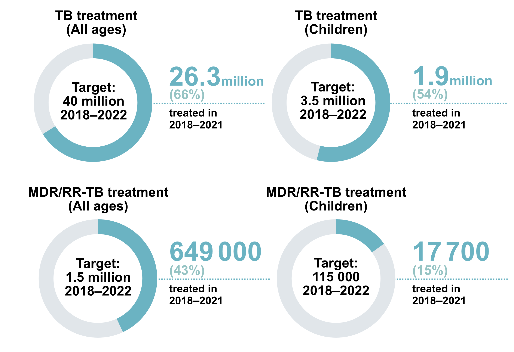

```{r setup, include=FALSE}
# Set chunk options.
# Results "asis" is useful to output markdown from a function
# Suppress messages, warnings and also the ## at the beginning of printed text

knitr::opts_chunk$set(echo = FALSE, 
                      results = "asis",
                      message = FALSE,
                      warning = FALSE,
                      error = TRUE)  # TEMP error=TRUE for debugging!

# Kill any attempt at using factors, unless we explicitly want them!
options(stringsAsFactors=FALSE)

# Load output packages ----
# - - - - - - - - - - - - - - - - - - - - - - - - - - - - - - - - - -
library(ggplot2)
library(dplyr)
library(scales)
library(RColorBrewer)
library(whomap)
library(gtbreport)
library(here)

# Get the data sets and computed values/statistics for section 3.1 ----
# - - - - - - - - - - - - - - - - - - - - - - - - - - - - - - - - - - - 
source(here('report/ch3-1_prepare_data.r'))

# Switch whether to show Irwin's donut chart
show_doughnuts = TRUE

# Save PDF
save_pdf = FALSE

# Quick functions for callouts in the text to the figures/tables:
# 1. lnk() Creates a link from text to a named anchor)
lnk <- function(display_name){
  return(paste0('<span class="red">[',
                display_name,
                '](#',
                gsub("[^a-zA-Z0-9]", "-", tolower(display_name)),
                ')</span>'))
}

# 2. anch() creates the named anchor to go above the figure or table
anch <- function(display_name){
  return(paste0('<a name="',
                gsub("[^a-zA-Z0-9]", "-", tolower(display_name)),
                '"></a>'))
}

```


```{css, echo=FALSE}

/* Styles to make it easier to see in the html_fragment; this CSS can be included in the CSS widget of Sitefinity */

.subhead, .footnote {
  font-size: 80%;
  line-height: 100%;
  font-weight: normal;
  margin: 0;
  padding: 0;
}

.subhead {
	margin-top: -15px; /* Bring subheadings closer to figure headings */
}

.red, .red a {
  color: #F21905; /* red text to show figure number */
}


/* notifications table */

/* Recreating simple striped bootstrap table */
#notifs_table {
  border-spacing: 0;
  border-collapse: collapse;
  margin-top: 1em;
  margin-bottom: 1em;
  /* Next two lines to allow horizontal scrolling on narrow screens */
  display: block;
  overflow-x: auto;
}

#notifs_table th {
  border-bottom: 2px solid #DDDDDD;
  padding: 8px;
}

#notifs_table td {
  border-top: 1px solid #DDDDDD;
  padding: 8px;
}

/* light gray for odd rows */
#notifs_table tr:nth-child(odd) td {
  background-color: #F5F5F5;	
}

/* Bold for the final row with thick line above */
#notifs_table tr:last-child td {
  border-top: 2px solid #DDDDDD;
  font-weight:bold;	
}

/* light gray when hovering over a row */
#notifs_table tr:hover td {
  background-color: #DDDDDD;
}

/* Centre-align all column headings except for the first */
#notifs_table th:not(:first-child) {
  text-align: center !important;
}

/* prevent numbers from wrapping in any of the columns */
#notifs_table td {
  white-space: nowrap;
}

```

# 3.1 Case notifications  


_Draft! Prepared `r Sys.Date()` using country-reported data CSV files dated `r csv_datestamp` `r if(show_estimates){paste0('and estimates files dated ', csv_estimate_datestamp)}`_

Data on the number of people diagnosed with tuberculosis (TB), based on standard case definitions and associated guidance on the recording and reporting of data provided by WHO, have been systematically collected at national level and then reported to WHO on an annual basis since the mid-1990s.
Globally in 2021, `r ftb(t3.1.1_global$c_newinc/1e6)` million people with a new episode of TB (new and relapse cases) were diagnosed and notified (`r lnk("Table 3.1.1")`). Of these, `r ftb(t3.1.1_txt$c_pulm_p)`% had pulmonary TB. Collectively, the African, South-East Asia and Western Pacific Regions accounted for almost `r ceiling(t3.1.1_txt$c_newinc_cum_p/10)*10`% of total notifications, with close to half in the South-East Asia Region alone. 

### `r anch("Table 3.1.1")`<span class="red">Table 3.1.1</span> Notifications of TB, HIV-positive TB, MDR/RR-TB and XDR-TB cases, globally and for WHO regions, `r report_year - 1`

```{r table_3.1}

# Use t3.1.1_data  dataframe created by io/ch_notifications.r

# format the numerical data 
t3.1.1_data <- t3.1.1_data %>%
  mutate(across(where(is.numeric), int_spacer))

# Add % symbol to pct fields
t3.1.1_data <- t3.1.1_data %>%
  mutate(newrel_pulm_conf_pct = paste0(newrel_pulm_conf_pct, "%"),
         newrel_ep_pct = paste0(newrel_ep_pct, "%"))

# Create a table object using kable
table_header <- c('WHO region',
                  'Total notified',
                  'New and relapse^a^',
                  'Pulmonary new and relapse number',
                  'Pulmonary new and relapse bacteriologically confirmed (%)',
                  'Extrapulmonary new and relapse (%)',
                  'HIV-positive new and relapse',
                  'MDR/RR-TB only^b^',
                  'pre-XDR-TB or XDR-TB^c^')

knitr::kable(t3.1.1_data,
             format = "html",
             col.names = table_header,
             align = 'lrrrccrrr',
             # Add a table ID so that it can be styled using extra CSS in Sitefinity
             table.attr = "id='notifs_table'")


```
<div class="footnote">^a^ *New and relapse* includes cases for which the treatment history is unknown. It excludes cases that have been re-registered as *treatment after failure*, as *treatment after lost to follow up* or as *other previously treated* (whose outcome after the most recent course of treatment is unknown or undocumented).  
^b^ TB that is resistant to rifampicin, excluding any cases with known resistance to any fluroquinolone.  
^c^ Pre-XDR-TB is TB that is resistant to rifampicin and to any fluoroquinolone. XDR-TB is TB that is resistant to rifampicin and to any fluoroquinolone and to at least one of bedaquiline or linezolid.</div>


<br />
The big drop in the total number of people newly diagnosed and officially reported with TB in `r report_year-2` compared with `r report_year-3`, from `r ftb(f3.1.1_txt$c_newinc_y3/1e6)` to `r ftb(f3.1.1_txt$c_newinc_y2/1e6)` million (`r round(f3.1.1_txt$pct_dif,0)`%), was one of the main findings of the *Global Tuberculosis Report `r report_year-1`*. The increase to `r ftb(f3.1.1_txt$c_newinc_y1/1e6)` million in `r report_year-1` (`r lnk("Fig. 3.1.1")`) suggests a partial recovery in TB detection, following the major disruptions to provision of essential TB services caused by the COVID-19 pandemic. However, notifications in `r report_year-1` were still `r round(f3.1.1_txt$pct_dif2,0)*(-1)`% below the level of `r report_year-3` and there are wide gaps between the estimated number of people who develop TB each year (incident cases) and the number detected and reported, reflecting a mixture of underreporting of detected cases and underdiagnosis. Gaps between notifications and estimates of TB incidence, especially in the 10 countries that account for most of the global gap, are discussed further in <span class="red">Section 3.3</span>.

The global trend of a big decrease in the number of people newly diagnosed with TB in `r report_year-2` and a partial recovery in `r report_year-1` has been driven by trends in the South-East Asia Region. A similar pattern is evident in the Eastern Mediterranean Region and the Region of the Americas; in contrast, there was no recovery in the Western Pacific Region in `r report_year-1`. The African Region stands out as having only a small reduction in TB notifications in `r report_year-2` followed by an increase in `r report_year-1`. 

### `r anch("Fig. 3.1.1")`<span class="red">Fig. 3.1.1</span> Notifications of TB cases (new and relapse cases, all forms) (black) compared with estimated TB incident cases <span style="color:`r gtbreport::palette_gtb("inc")`">(green)</span>, 2000&#8211;`r report_year - 1`, globally and for WHO regions  
<div class="subhead">The shaded area represents the 95% uncertainty interval.</div>  

```{r fig_3.1.1, fig.alt="Panel plot of incidence estimates compared to notifications by WHO region and globally since 2000",fig.height=6,  eval=show_estimates}

f3.1.1a_plot <- f3.1.1_data %>% 
  
  filter(entity=="Global") %>%
  
  ggplot(aes(x=year, y=c_newinc, ymin=0)) +
  
  geom_line(size=1) +
  
  geom_ribbon(aes(x=year, 
                  ymin=e_inc_num_lo, 
                  ymax=e_inc_num_hi),
              fill=gtbreport::palette_gtb("inc"),
              alpha=0.4) +
  
  geom_line(aes(year, e_inc_num),
            size=1,
            colour=gtbreport::palette_gtb("inc")) +

  facet_wrap( ~ entity, ncol = 4, scales="free_y") +
  
  scale_x_continuous(name="Year",
                     breaks = c(2000, 2010, report_year-1)) +

  # display y-axis scale in millions
  scale_y_continuous(name = "Millions per year", 
                     # Use the remainder operator in the labeller function to make sure we don't get weird effects
                     # when plotting small numbers
                     labels = function(i){ifelse((i/1e6) %% 1 == 0, round(i/1e6), round(i/1e6, 1))}) +

  theme_gtb()  +
  
  # Get rid of annoying x-axis line and ticks
  theme(axis.line.x = ggplot2::element_blank(),
        axis.ticks.x = element_blank())
  
print(f3.1.1a_plot)


f3.1.1b_plot <- f3.1.1_data %>% 
    
  filter(entity!="Global") %>%

  ggplot(aes(x=year, y=c_newinc, ymin=0)) +
  
  geom_line(size=1) +
  
  geom_ribbon(aes(x=year, 
                  ymin=e_inc_num_lo, 
                  ymax=e_inc_num_hi),
              fill=gtbreport::palette_gtb("inc"),
              alpha=0.4) +
  
  geom_line(aes(year, e_inc_num),
            size=1,
            colour=gtbreport::palette_gtb("inc")) +

  facet_wrap( ~ entity, ncol = 3, scales="free_y") +
  
  scale_x_continuous(name="Year",
                     breaks = c(2000, 2010, report_year-1)) +

  # display y-axis scale in millions
  scale_y_continuous(name = "Millions per year", 
                     # Use the remainder operator in the labeller function to make sure we don't get weird effects
                     # when plotting small numbers
                     labels = function(i){ifelse((i/1e6) %% 1 == 0, round(i/1e6), round(i/1e6, 1))}) +

  theme_gtb()  +
  
  # Get rid of annoying x-axis line and ticks
  theme(axis.line.x = ggplot2::element_blank(),
        axis.ticks.x = element_blank())
  
print(f3.1.1b_plot)

```
<div id="fig_3_1_1_global"></div>

<div class="row">
<div class="col-md-4">
<div id="fig_3_1_1_afro"></div>
</div>
<div class="col-md-4">
<div id="fig_3_1_1_amro"></div>
</div>
<div class="col-md-4">
<div id="fig_3_1_1_searo"></div>
</div>
</div>

<div class="row">
<div class="col-md-4">
<div id="fig_3_1_1_euro"></div>
</div>
<div class="col-md-4">
<div id="fig_3_1_1_emro"></div>
</div>
<div class="col-md-4">
<div id="fig_3_1_1_wpro"></div>
</div>
</div>

<br />
In the 30 high TB burden countries, trends in notifications vary considerably (`r lnk("Fig. 3.1.2")`). In `r report_year-2`, the first full year of the COVID-19 pandemic, there were particularly large absolute and relative reductions in India, Indonesia and Philippines, followed by some recovery in `r report_year-1`. Countries such as Bangladesh and Pakistan experienced large reductions in `r report_year-2` but recovered to above `r report_year-3` levels in `r report_year-1`. In some other Asian countries, such as Thailand and Viet Nam, there was a limited impact on notifications in `r report_year-2` but a large impact in `r report_year-1`; while in others such as Mongolia and Myanmar there were reductions that departed from the historic trend in both `r report_year-2` and `r report_year-1`. In most high TB burden countries in the African Region, notifications either fell in line with the historic trend or increased; an exception is Angola. Further analysis of notification trends during the COVID-19 pandemic is provided in <span class="red">Section 1</span>.  

### `r anch("Fig. 3.1.2")`<span class="red">Fig. 3.1.2</span> Notifications of people newly diagnosed with TB (new and relapse cases, all forms) (black) compared with estimated TB incident cases^a^ <span style="color:`r gtbreport::palette_gtb("inc")`">(green)</span>, 2000&#8211;`r report_year - 1`, 30 high TB burden countries   
<div class="subhead">The shaded area represents the 95% uncertainty interval.</div>  

```{r fig_3.1.2, fig.alt="Panel plot of incidence estimates compared to notifications for 30 countries since 2000", fig.height=12, eval=show_estimates}

f3.1.2_plot <- f3.1.2_data %>% 
  
  ggplot(aes(x=year, y=c_newinc, ymin=0)) +
  
  geom_line(size=1) +
  
  geom_ribbon(aes(x=year, 
                  ymin=e_inc_num_lo, 
                  ymax=e_inc_num_hi),
              fill=gtbreport::palette_gtb("inc"),
              alpha=0.4) +
  
  geom_line(aes(year, e_inc_num),
            size=1,
            colour=gtbreport::palette_gtb("inc")) +

  facet_wrap( ~ country, 
              ncol = 5, 
              scales="free_y",
              # Use the labeller function to make sure long country names are wrapped in panel headers
              labeller = label_wrap_gen(width = 20)) +
  
  scale_x_continuous(name="Year",
                     breaks = c(2000, 2010, report_year-1)) +

  # display y-axis scale in millions
  scale_y_continuous(name = "Thousands per year", 
                     # Use the remainder operator in the labeller function to make sure we don't get weird effects
                     # when plotting small numbers
                     labels = function(i){ifelse((i/1e3) %% 1 == 0, int_spacer(i/1e3), round(i/1e3, 1))}) +

  theme_gtb()  +
  
  # Get rid of annoying x-axis line and ticks
  theme(axis.line.x = ggplot2::element_blank(),
        axis.ticks.x = element_blank())
  
print(f3.1.2_plot)

```
<div class="row">
<div class="col-md-4">
<div id="fig_3_1_2_AGO"></div>
</div>
<div class="col-md-4">
<div id="fig_3_1_2_BGD"></div>
</div>
<div class="col-md-4">
<div id="fig_3_1_2_BRA"></div>
</div>
</div>

<div class="row">
<div class="col-md-4">
<div id="fig_3_1_2_CAF"></div>
</div>
<div class="col-md-4">
<div id="fig_3_1_2_CHN"></div>
</div>
<div class="col-md-4">
<div id="fig_3_1_2_COG"></div>
</div>
</div>

<div class="row">
<div class="col-md-4">
<div id="fig_3_1_2_PRK"></div>
</div>
<div class="col-md-4">
<div id="fig_3_1_2_COD"></div>
</div>
<div class="col-md-4">
<div id="fig_3_1_2_ETH"></div>
</div>
</div>

<div class="row">
<div class="col-md-4">
<div id="fig_3_1_2_GAB"></div>
</div>
<div class="col-md-4">
<div id="fig_3_1_2_IND"></div>
</div>
<div class="col-md-4">
<div id="fig_3_1_2_IDN"></div>
</div>
</div>

<div class="row">
<div class="col-md-4">
<div id="fig_3_1_2_KEN"></div>
</div>
<div class="col-md-4">
<div id="fig_3_1_2_LSO"></div>
</div>
<div class="col-md-4">
<div id="fig_3_1_2_LBR"></div>
</div>
</div>

<div class="row">
<div class="col-md-4">
<div id="fig_3_1_2_MNG"></div>
</div>
<div class="col-md-4">
<div id="fig_3_1_2_MOZ"></div>
</div>
<div class="col-md-4">
<div id="fig_3_1_2_MMR"></div>
</div>
</div>

<div class="row">
<div class="col-md-4">
<div id="fig_3_1_2_NAM"></div>
</div>
<div class="col-md-4">
<div id="fig_3_1_2_NGA"></div>
</div>
<div class="col-md-4">
<div id="fig_3_1_2_PAK"></div>
</div>
</div>

<div class="row">
<div class="col-md-4">
<div id="fig_3_1_2_PNG"></div>
</div>
<div class="col-md-4">
<div id="fig_3_1_2_PHL"></div>
</div>
<div class="col-md-4">
<div id="fig_3_1_2_SLE"></div>
</div>
</div>

<div class="row">
<div class="col-md-4">
<div id="fig_3_1_2_ZAF"></div>
</div>
<div class="col-md-4">
<div id="fig_3_1_2_THA"></div>
</div>
<div class="col-md-4">
<div id="fig_3_1_2_UGA"></div>
</div>
</div>

<div class="row">
<div class="col-md-4">
<div id="fig_3_1_2_TZA"></div>
</div>
<div class="col-md-4">
<div id="fig_3_1_2_VNM"></div>
</div>
<div class="col-md-4">
<div id="fig_3_1_2_ZMB"></div>
</div>
</div>

<div class="footnote">^a^  Incidence estimates for India are interim and subject to finalization, in consultation with the Health Ministry & Family Welfare, India.</div>


<br />
Globally, the cumulative total number of people diagnosed with TB and officially reported from 2018 to `r report_year-1` is `r ftb(f3.1.3_txt$c_newinc/1e6)` million, only `r ftb(f3.1.3_txt$c_newinc*100/40e6)`% of the 5-year target of 40 million between 2018 and 2022 that was set at the UN high-level meeting on TB in 2018 (`r lnk("Fig. 3.1.3")`). The target for detection and treatment of people with drug-resistant (DR) TB appears even further out of reach, as are the targets for treatment of children specifically.

### `r anch("Fig. 3.1.3")`<span class="red">Fig. 3.1.3</span> Global progress in the number of people treated for TB between 2018 and `r report_year-1`, compared with cumulative targets set for 2018&#8211;2022 at the UN high-level meeting on TB 

```{r eval=show_doughnuts, out.width = '80%'}


# cat('
# 
# ')

```

```{r fig_3.1.3, eval=!show_doughnuts, fig.alt="Doughnut chart showing how much of the UN high level meeting targets for 2018-2022 have been completed"}


# The code below produces a bar chart as an alternative to the doughnuts produced by Irwin
f3.1.3_plot <- f3.1.3_data %>%

  ggplot(aes(x=target_completion, y=value)) +
  geom_bar(stat="identity", fill="darkblue",width = 0.5) +

  expand_limits(y=c(0,100)) +
  scale_y_continuous(breaks = c(20, 40, 60 , 80, 100)) +
  ylab("Percent achieved") +
  scale_x_discrete(limits = c("rrmdr_014_tx_pct",
                              "rr_treated_pct",
                              "c_new_014_pct",
                              "c_newinc_pct"),
                   labels = c("115 thousand children treated\nfor drug-resistant TB",
                              "1.5 million treated\nfor drug-resistant TB",
                              "3.5 million children notified",
                              "40 million notified")) +
  xlab("2018-2022 cumulative target") +
  coord_flip() +

  theme_gtb() +
  geom_text(aes(label=round(value,0),x=target_completion,y=value*1.05),vjust=0.5,hjust=-0,col="black",size=3)


print(f3.1.3_plot)

```


<br />
Most notified cases of TB are among adults (`r lnk("Fig. 3.1.4")`). Of the global total of people with a new or relapse episode of TB who were notified in `r report_year - 1`, `r ftb(f3.1.4_txt$pct_m)`% were men, `r ftb(f3.1.4_txt$pct_f)`% were women and `r ftb(f3.1.4_txt$pct_c)`% were children (aged 0&#8211;14 years). In general, notification data appear to understate the share of the TB disease burden accounted for by men, since higher M:F ratios among adults have been found in national TB prevalence surveys (<span class="red">Section 2.4</span>). 

### `r anch("Fig. 3.1.4")`<span class="red">Fig. 3.1.4</span> The global number of people reported to have been treated for TB disease, 2015&#8211;`r report_year - 1`
```{r fig_3.1.4, fig.alt="Bar chart showing numbers of adults and children notified with TB each year since 2015"}

f3.1.4_plot <- f3.1.4_data %>% 
  
  ggplot(aes(x=year, y=how_many, fill=age_group)) +

  geom_bar(stat = "identity")  +
  
  scale_x_continuous(name="",
                     breaks = 2015:(report_year-1)) +
  
  # display y-axis scale in millions
  scale_y_continuous(name = "Millions", 
                     labels = function(i){round(i/1e6)},
                     limits = c(0, 8e6)) +

  scale_fill_manual("",
                    breaks = c("c_new_15plus", "c_new_014" ),
                    labels = c("Adults aged \u226515 years", "Children aged 0\u201314 years"),
                    values = c("c_new_15plus"="#08acac", "c_new_014"="red")) +


  theme_gtb() +
  # Get rid of annoying x-axis line and ticks
  theme(axis.line.x = ggplot2::element_blank(),
        axis.ticks.x = element_blank())

print(f3.1.4_plot)

```
<div id="fig_3_1_4"></div>


<br />
The global male:female (M:F) ratio for TB notifications in `r report_year - 1` was `r ftb(f3.1.5_txt$mf_ratio)`. The distribution of notified cases by age and sex varies among WHO regions (`r lnk("Fig. 3.1.5")`). 

### `r anch("Fig. 3.1.5")`<span class="red">Fig. 3.1.5</span> Estimated TB incidence (grey outline) and notification rates (new and relapse cases) by age group and sex^a^ (female in <span style="color:`r gtbreport::palette_gtb("female")`;"> purple</span>; male in <span style="color:`r gtbreport::palette_gtb("male")`;">green</span>) in `r report_year-1`, globally and for WHO regions 

```{r fig_3.1.5, fig.alt="Panel plot of incidence rate estimates and notification rates by age group and sex as population pyramid-style bar charts", eval=show_estimates}

f3.1.5_plot <- f3.1.5_data  %>%

  # Multiply all the female numbers by -1
  mutate(cnr = ifelse(sex == "Female", cnr * -1, cnr ),
         inc_100k = ifelse(sex == "Female", inc_100k * -1, inc_100k )) %>%

  ggplot() +

  geom_bar(aes(x=age_group, y=inc_100k, fill="inc"),
           stat="identity",
           size=.3,
           colour="black",
           position="identity") +

    geom_bar(aes(x=age_group, y=cnr, fill=sex),
           stat="identity",
           width = 0.7,
           size=.3,
           position="identity") +

  scale_fill_manual(breaks=c("Female", "Male", "inc"),
                    values=c(gtbreport::palette_gtb("female"), 
                             gtbreport::palette_gtb("male"),
                             "#EEEEEE")) +

  scale_y_continuous(name = "Rate per 100 000 population per year",
                     labels = abs) +

  scale_x_discrete(name = "Age group (years)") +

  coord_flip() +

  facet_wrap( ~ entity, ncol = 4, scales = "free_x") +

  theme_gtb()  +
  
  # suppress the legend
  theme(legend.position="none")


print(f3.1.5_plot)

```
<div id="fig_3_1_5_global"></div>

<div class="row">
<div class="col-md-4">
<div id="fig_3_1_5_afro"></div>
</div>
<div class="col-md-4">
<div id="fig_3_1_5_amro"></div>
</div>
<div class="col-md-4">
<div id="fig_3_1_5_searo"></div>
</div>
</div>

<div class="row">
<div class="col-md-4">
<div id="fig_3_1_5_euro"></div>
</div>
<div class="col-md-4">
<div id="fig_3_1_5_emro"></div>
</div>
<div class="col-md-4">
<div id="fig_3_1_5_wpro"></div>
</div>
</div>

<div class="footnote">^a^ Data from `r f3.1.5_excluded$countries` countries and areas that did not report cases in these age categories are excluded. Cases included accounted for `r ftb(f3.1.5_excluded$agesex_pct)`% of reported cases.</div>


<br />
There is considerable country variation in the proportion of notified cases that are children (`r lnk("Fig. 3.1.6")`). There are recognized issues with the diagnosis and reporting of TB in children, including the use of variable case definitions and underreporting of cases diagnosed by paediatricians in the public and private sectors. Greater attention to the quality of TB notification data for children is warranted in many countries.

### `r anch("Fig. 3.1.6")`<span class="red">Fig. 3.1.6</span> Percentage of people with a new or relapse episode of TB who were children (aged 0&#8211;14 years), `r report_year-1`

```{r fig_3.1.6, fig.alt="Map showing percentage of new and relapse TB cases that were children"}

f3.1.6_plot <- f3.1.6_data %>% 
  
  whomap(colours = brewer.pal(4, "BuGn"),
         legend.title = "Percentage (%)",
         na.col = "white",
         water.col = "white")


print(f3.1.6_plot)

```


<br />
There is also considerable country variation in the proportion of notified cases that are diagnosed with extrapulmonary TB (`r lnk("Fig. 3.1.7")`). This may reflect underlying differences in TB epidemiology as well as diagnostic practices. 

### `r anch("Fig. 3.1.7")`<span class="red">Fig. 3.1.7</span> Percentage of people with a new or relapse episode of TB who were diagnosed with extrapulmonary TB at country level, `r report_year-1`

```{r fig_3.1.7, fig.alt="Map showing percentage of extrapulmonary cases among new and relapse TB cases"}

f3.1.7_plot <- f3.1.7_data %>% 
  
  whomap(colours = brewer.pal(4, "YlOrRd"),
         legend.title = "Percentage (%)",
         na.col = "white",
         water.col = "white")


print(f3.1.7_plot)

```


<br />
Engagement of all care providers in the public and private sectors through public–private mix (PPM) initiatives can help to minimize the underreporting of people diagnosed with TB. Since 2015, the contribution of such initiatives to total notifications has grown in most of the seven countries defined as top global priorities for PPM (`r lnk("Fig. 3.1.8")`). 


### `r anch("Fig. 3.1.8")`<span class="red">Fig. 3.1.8</span> Contribution of public-private mix to notifications of people diagnosed with TB in priority countries, 2010&#8211;`r report_year - 1`

```{r fig_3.1.8, fig.alt="Panel plot of line charts showing percentage contribution of the private sector to TB notifications by year since 2010"}

f3.1.8_plot <- f3.1.8_data %>% 
  
  ggplot(aes(x=year, y=private_pcnt, ymin=0)) +

  geom_line(size = 1.5, colour = "slateblue4") +
  
  facet_wrap(~ country, ncol = 4) +
  
  scale_x_continuous(name="Year",
                     breaks = c(2010, 2015,report_year-1)) +
  
  scale_y_continuous(name = "Contribution of public-private mix to total notifications (%)") +
  
  theme_gtb() +
  
  # Get rid of annoying x-axis line and ticks
  theme(axis.line.x = ggplot2::element_blank(),
        axis.ticks.x = element_blank())

print(f3.1.8_plot)  

```
<div class="row">
<div class="col-md-4">
<div id="fig_3_1_8_BGD"></div>
</div>
<div class="col-md-4">
<div id="fig_3_1_8_IND"></div>
</div>
<div class="col-md-4">
<div id="fig_3_1_8_IDN"></div>
</div>
</div>

<div class="row">
<div class="col-md-4">
<div id="fig_3_1_8_MMR"></div>
</div>
<div class="col-md-4">
<div id="fig_3_1_8_NGA"></div>
</div>
<div class="col-md-4">
<div id="fig_3_1_8_PAK"></div>
</div>
</div>

<div class="row">
<div class="col-md-4">
<div id="fig_3_1_8_PHL"></div>
</div>
<div class="col-md-4">
</div>
<div class="col-md-4">
</div>
</div>


<br />
Community engagement can help with referrals of people with TB symptoms to health facilities as well as treatment support; in `r filter(f3.1.9_data, dc_engage_community_display==1) %>% nrow()` countries from which WHO requested data in `r report_year-1`, such engagement was reported in a high proportion of basic management units (`r lnk("Fig. 3.1.9")`). 

### `r anch("Fig. 3.1.9")`<span class="red">Fig. 3.1.9</span> Percentage of basic management units at country level in which there was community contribution to new TB case finding and/or to treatment adherence support,^a^ `r report_year-1`

```{r fig_3.1.9, fig.alt="Map showing percentage of management units with community contributions to case finding and/or treatment support"}

f3.1.9_plot <- f3.1.9_data %>% 
  
  whomap(colours = brewer.pal(4, "OrRd"),
         legend.title = "Percentage (%)",
         na.col = "white",
         water.col = "white")


print(f3.1.9_plot)

```
<div class="footnote">^a^ Data only requested from `r filter(f3.1.9_data, dc_engage_community_display==1) %>% nrow()` countries.</div>


<br />
Case-based digital surveillance systems enable timely reporting and use of TB data. The current status of progress in transitioning from paper-based aggregated reporting systems to case-based digital surveillance is shown in `r lnk("Fig. 3.1.10")`. Acceleration of progress in making this transition is needed in the African Region. 

### `r anch("Fig. 3.1.10")`<span class="red">Fig. 3.1.10</span> Countries with national case-based digital surveillance systems for TB, `r report_year-1`

```{r fig_3.1.10, fig.alt="Map showing which countries have case-based TB surveillance systems"}

f3.1.10_plot <- f3.1.10_data %>% 
  
  whomap(colours = brewer.pal(4, "Blues"),
         legend.title = "Country response",
         na.col = "white",
         water.col = "white")


print(f3.1.10_plot)

```


Further country-specific details about TB notifications are available in the [Global tuberculosis report app](https://www.who.int/teams/global-tuberculosis-programme/data#app) and [country profiles](https://worldhealthorg.shinyapps.io/tb_profiles/).

Data shown on this webpage are as of `r format(as.Date(csv_datestamp), format="%d %B %Y")` (see <span class="red">Annex 2</span> of the main report for more details).

```{r eval=save_pdf}
# this section is for saving .pdf and .csv for graphic design for PDF report - not web version!
# fig 21
# inc_global %>% write_csv(here("./report/pdf/fig21.csv"))   # write csv for Sue
# ggsave(here('report/pdf/fig21.pdf'), plot=f3.1.1a_plot, width=12, height=8)

# fig 23
f3.1.4_data %>% write_csv(here("./report/pdf/fig23.csv"))   # write csv for Sue
ggsave(here('report/pdf/fig23.pdf'), plot=f3.1.4_plot, width=12, height=8)

```

