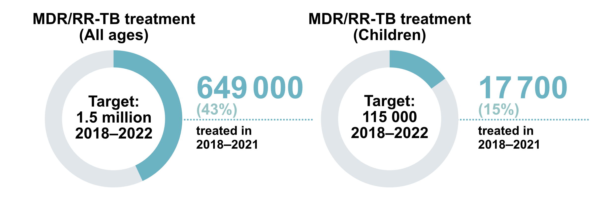

```{r setup, include=FALSE}
# Set chunk options.
# Results "asis" is useful to output markdown from a function
# Suppress messages, warnings and also the ## at the beginning of printed text

knitr::opts_chunk$set(echo = FALSE, 
                      results = "asis",
                      message = FALSE,
                      warning = FALSE,
                      error = TRUE)  # TEMP error=TRUE for debugging!

# Kill any attempt at using factors, unless we explicitly want them!
options(stringsAsFactors=FALSE)

# Load output packages ----
# - - - - - - - - - - - - - - - - - - - - - - - - - - - - - - - - - -
library(ggplot2)
library(dplyr)
library(scales)
library(RColorBrewer)
library(whomap)
library(gtbreport)
library(here)
library(readr)

# Get the data sets and computed values/statistics for section 3.4 ----
# - - - - - - - - - - - - - - - - - - - - - - - - - - - - - - - - - - - 
source(here('report/ch3-4_prepare_data.r'))

# Switch whether to show Irwin's donut chart
show_doughnuts = TRUE

# Save PDF
save_pdf = FALSE

# Quick functions for callouts in the text to the figures/tables:
# 1. lnk() Creates a link from text to a named anchor)
lnk <- function(display_name){
  return(paste0('<span class="red">[',
                display_name,
                '](#',
                gsub("[^a-zA-Z0-9]", "-", tolower(display_name)),
                ')</span>'))
}

# 2. anch() creates the named anchor to go above the figure or table
anch <- function(display_name){
  return(paste0('<a name="',
                gsub("[^a-zA-Z0-9]", "-", tolower(display_name)),
                '"></a>'))
}

# 3. ref_lnk() creates a link from text to the references in the WHO style (black, italic)
ref_lnk <- function(display_name){
  return(paste0('<span class="refs">[', 
                display_name, 
                '](#refs)</span>'))
}

```


```{css, echo=FALSE}

/* Styles to make it easier to see in the html_fragment; this CSS can be included in the CSS widget of Sitefinity */
  
.subhead, .footnote {
  font-size: 80%;
  line-height: 100%;
  font-weight: normal;
  margin: 0;
  padding: 0;
}

.subhead {
  margin-top: -15px; /* Bring subheadings closer to figure headings */
}

.red, .red a {
  color: #F21905; /* red text to show figure number */
}


.refs, .refs a {
  color: #3c4245;  /* match SF normal text colour */
  font-style: italic;
}

```

# 3.4 Drug-resistant TB treatment  

_Draft! Prepared `r Sys.Date()` using country-reported data CSV files dated `r csv_datestamp` `r if(show_estimates){paste0('and estimates files dated ', csv_estimate_datestamp)}`_


Treatment for people diagnosed with rifampicin-resistant TB (RR-TB), isoniazid-resistant TB and multidrug-resistant TB (MDR-TB, defined as resistance to isoniazid and rifampicin) requires regimens that include second-line drugs, such as bedaquiline and fluoroquinolones; these regimens are more expensive (&#8805;US$ 1000 per person) and cause more side-effects than first-line treatments for drug-susceptible TB (`r ref_lnk("1")`). Pre-extensively drug-resistant TB (pre-XDR-TB, defined as TB that is resistant to rifampicin and any fluoroquinolone) and XDR-TB (resistance to rifampicin, any fluoroquinolone and at least one of bedaquiline or linezolid) are even harder to treat.

Globally in `r report_year-1`, `r int_spacer(f3.4.1_txt$rr_2021)` people were enrolled on treatment for MDR/RR-TB, a small increase of `r ftb(f3.4.1_txt$pct_increase_2021)`% from `r int_spacer(f3.4.1_txt$rr_2020)` in `r report_year-2` but still below `r int_spacer(f3.4.1_txt$rr_2019)` in `r report_year-3`. Most of those enrolled on treatment were adults (`r lnk("Fig. 3.4.1")`). 

### `r anch("Fig. 3.4.1")`<span class="red">Fig. 3.4.1</span> The global number of people reported to have been enrolled on treatment for MDR/RR-TB, 2015&#8211;`r report_year-1`
<div class="subhead">Global data disaggregated by age are not available for the years before 2018.</div>

```{r fig_3.4.1, fig.alt="Bar chart of numbers treated for MDR-TB each year since 2015"}

f3.4.1_plot <- f3.4.1_data %>% 

  ggplot(aes(x=year, y=how_many, fill = age_group)) +

  geom_bar(stat = "identity") +

  scale_x_continuous(name="", breaks =2015:report_year-1) +

  # display y-axis scale in thousands
  scale_y_continuous(name = "Thousands", labels = function(i){round(i/1e3)},
                     limits = c(0,2e5)) +

  scale_fill_manual("",
                    breaks = c("all", "15plus", "014" ),
                    labels = c("All ages", "Adults aged \u226515 years or age not reported", "Children aged 0\u201314 years"),
                    values = c("all"="#A5D727", "15plus"=palette_gtb("succ"), "014"="red")) +
  
  theme_gtb() +
  
  # Get rid of annoying x-axis line and ticks
  theme(axis.line.x = ggplot2::element_blank(),
        axis.ticks.x = element_blank())

print(f3.4.1_plot)

```
<div id="fig_3_4_1"></div>


<br />
Trends in treatment enrolment between 2009 (the first year for which WHO collected data from all countries) and `r report_year-1` vary considerably by country (`r lnk("Fig. 3.4.2")`).

### `r anch("Fig. 3.4.2")`<span class="red">Fig. 3.4.2</span> Number of people diagnosed with MDR/RR-TB<span style="color:#277abe;"> (blue)</span> and enrolled on MDR-TB treatment<span style="color:red;"> (red)</span>, 2010&#8211;`r report_year-1`, 30 high MDR-TB burden countries

```{r fig_3.4.2, fig.alt="Panel of line charts of MDR/RR-TB cases detected, MDR/RR-TB put on treatment since 2010 for 30 countries", fig.height=12}

f3.4.2_plot <- f3.4.2_data %>%
  
  ggplot(aes(x=year, y=rr_detected, ymin=0)) +
  
  geom_line(size=1, colour = "#277abe") +
  
  geom_line(aes(year, rr_treated),
                      size=1,
                      colour="Red") +
  
  facet_wrap( ~ country, 
              ncol = 5, 
              scales="free_y",
              # Use the labeller function to make sure long country names are wrapped in panel headers
              labeller = label_wrap_gen(width = 20)) +

  scale_x_continuous(name = "Year", breaks = c(2010, 2015, report_year-1)) +
  
  scale_y_continuous(name = "Number of cases",
                     labels = int_spacer) + 
  
  theme_gtb()  +
  
  # Get rid of annoying x-axis line and ticks
  theme(axis.line.x = ggplot2::element_blank(),
        axis.ticks.x = element_blank())


print(f3.4.2_plot)

```
<div class="row">
<div class="col-md-4">
<div id="fig_3_4_2_AGO"></div>
</div>
<div class="col-md-4">
<div id="fig_3_4_2_AZE"></div>
</div>
<div class="col-md-4">
<div id="fig_3_4_2_BGD"></div>
</div>
</div>
<div class="row">
<div class="col-md-4">
<div id="fig_3_4_2_BLR"></div>
</div>
<div class="col-md-4">
<div id="fig_3_4_2_CHN"></div>
</div>
<div class="col-md-4">
<div id="fig_3_4_2_PRK"></div>
</div>
</div>
<div class="row">
<div class="col-md-4">
<div id="fig_3_4_2_COD"></div>
</div>
<div class="col-md-4">
<div id="fig_3_4_2_IND"></div>
</div>
<div class="col-md-4">
<div id="fig_3_4_2_IDN"></div>
</div>
</div>
<div class="row">
<div class="col-md-4">
<div id="fig_3_4_2_KAZ"></div>
</div>
<div class="col-md-4">
<div id="fig_3_4_2_KGZ"></div>
</div>
<div class="col-md-4">
<div id="fig_3_4_2_MNG"></div>
</div>
</div>
<div class="row">
<div class="col-md-4">
<div id="fig_3_4_2_MOZ"></div>
</div>
<div class="col-md-4">
<div id="fig_3_4_2_MMR"></div>
</div>
<div class="col-md-4">
<div id="fig_3_4_2_NPL"></div>
</div>
</div>
<div class="row">
<div class="col-md-4">
<div id="fig_3_4_2_NGA"></div>
</div>
<div class="col-md-4">
<div id="fig_3_4_2_PAK"></div>
</div>
<div class="col-md-4">
<div id="fig_3_4_2_PNG"></div>
</div>
</div>
<div class="row">
<div class="col-md-4">
<div id="fig_3_4_2_PER"></div>
</div>
<div class="col-md-4">
<div id="fig_3_4_2_PHL"></div>
</div>
<div class="col-md-4">
<div id="fig_3_4_2_MDA"></div>
</div>
</div>
<div class="row">
<div class="col-md-4">
<div id="fig_3_4_2_RUS"></div>
</div>
<div class="col-md-4">
<div id="fig_3_4_2_SOM"></div>
</div>
<div class="col-md-4">
<div id="fig_3_4_2_ZAF"></div>
</div>
</div>
<div class="row">
<div class="col-md-4">
<div id="fig_3_4_2_TJK"></div>
</div>
<div class="col-md-4">
<div id="fig_3_4_2_UKR"></div>
</div>
<div class="col-md-4">
<div id="fig_3_4_2_UZB"></div>
</div>
</div>
<div class="row">
<div class="col-md-4">
<div id="fig_3_4_2_VNM"></div>
</div>
<div class="col-md-4">
<div id="fig_3_4_2_ZMB"></div>
</div>
<div class="col-md-4">
<div id="fig_3_4_2_ZWE"></div>
</div>
</div>


<br />
The cumulative total number of people reported as enrolled on treatment for MDR/RR-TB from 2018 to `r report_year-1` was `r int_spacer(f3.4.3_txt$rr_treated)`, only `r int_spacer(f3.4.3_txt$rr_treated_pct)`% of the 5-year target (2018-2022) of 1.5 million that was set at the UN high-level meeting on TB in 2018. For children specifically, the cumulative number was `r int_spacer(f3.4.3_txt$rrmdr_014_tx)`, only `r int_spacer(f3.4.3_txt$rrmdr_014_tx_pct)`% of the 5-year target of 115 000.


### `r anch("Fig. 3.4.3")`<span class="red">Fig. 3.4.3</span> Global progress in the number of people treated for MDR/RR-TB between 2018 and `r report_year-1`, compared with cumulative targets set for 2018&#8211;2022 at the UN high-level meeting on TB

```{r eval=show_doughnuts, out.width = '60%'}



# cat('
# 
# ')
```

```{r fig_3.4.3, eval=!show_doughnuts}

# cat('
# 
# ')
f3.4.3_plot <- f3.4.3_data %>%

  ggplot(aes(x=target_completion, y=value)) +
  geom_bar(stat="identity", fill="darkblue",width = 0.5) +

  expand_limits(y=c(0,100)) +
  scale_y_continuous(breaks = c(20, 40, 60 , 80, 100)) +
  ylab("Percent achieved") +
  scale_x_discrete(limits = c("rrmdr_014_tx_pct",
                              "rr_treated_pct"),
                   labels = c("115 thousand children treated\nfor drug-resistant TB",
                              "1.5 million treated\nfor drug-resistant TB")) +
  xlab("2018-2022 cumulative target") +
  coord_flip() +

  theme_gtb() +
  geom_text(aes(label=round(value,0),x=target_completion,y=value*1.05),vjust=0.5,hjust=-0,col="black",size=3)

print(f3.4.3_plot)

```


<br />
The numbers of people being detected with MDR/RR-TB and enrolled on treatment fall far short of the estimated number of people developing MDR/RR-TB (incident cases) each year (`r lnk("Fig. 3.4.4")`). Closing the gap requires improvements in overall detection of people with TB (<span class="red">Section 3.3</span>), improvements in the percentage of those diagnosed with TB who were bacteriologically confirmed (necessary to test for drug resistance) and improvements in the coverage of testing for RR-TB (<span class="red">Section 3.2</span>).

### `r anch("Fig. 3.4.4")`<span class="red">Fig. 3.4.4</span> Number of people diagnosed with MDR/RR-TB<span style="color:#277abe;"> (blue)</span> and number enrolled on MDR/RR-TB treatment<span style="color:red;"> (red)</span>, compared with estimates of the number of incident cases of MDR/RR-TB (95% uncertainty interval shown in <span style="color:`r gtbreport::palette_gtb("inc")`">green</span>), 2015&#8211;`r report_year-1`, globally and for WHO regions  

```{r fig_3.4.4, fig.width=14, fig.height=6}
f3.4.4_plot <- f3.4.4_data %>% 
  
  ggplot(aes(x=year, y=rr_detected, ymin=0)) +
  
  geom_line(size=1, colour = "#277abe") +
  
  geom_line(aes(year, rr_treated),
            size=1,
            colour="Red") +
  
  geom_ribbon(aes(x=year, 
                  ymin=e_inc_rr_num_lo, 
                  ymax=e_inc_rr_num_hi),
              fill=gtbreport::palette_gtb("inc"),
              alpha=0.4) +
  
  geom_line(aes(year, e_inc_rr_num),
            size=1,
            colour=gtbreport::palette_gtb("inc")) +
  
  facet_wrap( ~ entity, ncol = 4, scales="free_y") +
  
  scale_x_continuous(name="Year"#,
                     # breaks = c(2015, report_year-1, by=2)
                     ) +
  
  # display y-axis scale in millions
  scale_y_continuous(name = "Number per year",labels=function(x) format(x, big.mark = " ", scientific = FALSE)) +
  # scale_y_continuous(name = "Per year", 
  #                    # Use the remainder operator in the labeller function to make sure we don't get weird effects
  #                    # when plotting small numbers
  #                    labels = function(i){ifelse((i/1e6) %% 1 == 0, round(i/1e6), round(i/1e6, 1))}) +
  
  theme_gtb()  +
  
  # Get rid of annoying x-axis line and ticks
  theme(axis.line.x = ggplot2::element_blank(),
        axis.ticks.x = element_blank())

print(f3.4.4_plot)


```
<div id="fig_3_4_4_global"></div>

<div class="row">
<div class="col-md-4">
<div id="fig_3_4_4_afro"></div>
</div>
<div class="col-md-4">
<div id="fig_3_4_4_amro"></div>
</div>
<div class="col-md-4">
<div id="fig_3_4_4_searo"></div>
</div>
</div>

<div class="row">
<div class="col-md-4">
<div id="fig_3_4_4_euro"></div>
</div>
<div class="col-md-4">
<div id="fig_3_4_4_emro"></div>
</div>
<div class="col-md-4">
<div id="fig_3_4_4_wpro"></div>
</div>
</div>


<br />
Estimated levels of treatment coverage in `r report_year-1` i.e. the number of people enrolled on treatment for MDR-TB in `r report_year-1` as a percentage of the estimated number of people who developed MDR/RR-TB (incident cases) remain low (`r lnk("Fig. 3.4.5")`). The WHO regions with the best treatment coverage are `r gsub("(Euro)|(Region of)", "the \\1\\2", knitr::combine_words(f3.4.5_txt_list_region$entity, oxford_comma=FALSE))`. Among the 30 high MDR/RR-TB burden countries, those with the best treatment coverage are `r report_year-1`:`r gsub("(Philip)|(Republic)|(Russian)", "the \\1\\2\\3", knitr::combine_words(f3.4.5_txt_list_hi$entity, oxford_comma=FALSE))`. Those with worrying low levels include `r sub("Democratic", "the Democratic", knitr::combine_words(f3.4.5_txt_list_lo$entity, oxford_comma=FALSE))`. 

### `r anch("Fig. 3.4.5")`<span class="red">Fig. 3.4.5</span> Estimated treatment coverage for MDR/RR-TB^a^ in `r report_year-1`, 30 high MDR-TB burden countries,^b^ WHO regions and globally

```{r fig_3.4.5, fig.asp=1,  eval=show_estimates}
f3.4.5_plot <- f3.4.5_data %>% 

  ggplot(aes(x=entity,
             y=c_rr_coverage)) +
  geom_point() +
  
  labs(x="",
       y="Treatment coverage (%)") +
  
  geom_pointrange(aes(ymin=c_rr_coverage_lo,
                      ymax=c_rr_coverage_hi),
                  size=1,
                  colour="Darkblue") +
  
  expand_limits(y=0) +
  coord_flip() +
  theme_gtb() 
  

print(f3.4.5_plot)

```
<div id="fig_3_4_5"></div>
<div class="footnote">^a^ the number of people started on treatment for MDR-TB as a percentage of the estimated incidence of MDR/RR-TB.<br />
^b^ Incidence estimates for India are interim and subject to finalization, in consultation with the Health Ministry & Family Welfare, India.</div>


<br />
There are 10 countries that account for `r ftb(f3.4.6_txt$pct_gap_top_ten)`% of the global gap between the estimated number of people who developed MDR/RR-TB in `r report_year-1` and the number of people enrolled on treatment for MDR/RR-TB (`r lnk("Fig. 3.4.6")`). 

### `r anch("Fig. 3.4.6")`<span class="red">Fig. 3.4.6</span> The ten countries with the largest gaps between the number of people started on treatment for MDR-TB and the best estimates of MDR/RR-TB incidence,^a^ `r report_year-1`

```{r fig_3.4.6,  eval=show_estimates}
# To help find centres of bubbles use
# filter(whomap:::centroid, id %in% f3.4.6_data$iso3) 
f3.4.6_plot <- f3.4.6_data %>%
  
  bubblemap(legend.title = "Size of gap",
            legend.pos = c(0.14, 0.5),
            bubble.col = "green3",
            scale.breaks = c(5e3, 5e4, 1e5),
            scale.limits = c(5e3, 1e5),
            scale.labels = c("5 000","50 000","100 000"),
            water.col = "white") +

  annotate(geom='text', label='Afghanistan', x=33, y=80, hjust=0, size=3) +
  geom_segment(x=66, xend=45, y=34, yend=74) +
  
  annotate(geom='text', label='Myanmar', x=150, y=17, hjust=0, size=3) +
  geom_segment(x=97, xend=145, y=21, yend=17) +
  
  annotate(geom='text', label='Russian Federation', x=130, y=80, hjust=0, size=3) +
  geom_segment(x=99, xend=125, y=62, yend=78) +
  
  annotate(geom='text', label='Ukraine', x=-35, y=45, hjust=0, size=3) +
  geom_segment(x=32, xend=-12, y=49, yend=45) +
  
  annotate(geom='text', label='China', x=150, y=38, hjust=0, size=3) +
  geom_segment(x=104, xend=145, y=37, yend=37) +
  
  annotate(geom='text', label='Pakistan', x=50, y=0, hjust=0, size=3) +
  geom_segment(x=70, xend=70, y=30, yend=5) +
  
  annotate(geom='text', label='India', x=65, y=-5, hjust=0, size=3) +
  geom_segment(x=80, xend=80, y=23, yend=-5) +
  
  annotate(geom='text', label='Indonesia', x=80, y=-15, hjust=0, size=3) +
  geom_segment(x=114, xend=105, y=0, yend=-12) +
  
  annotate(geom='text', label='Nigeria', x=-30, y=0, hjust=0, size=3) +
  geom_segment(x=8, xend=-5, y=10, yend=0) +
  
  annotate(geom='text', label='South Africa', x=50, y=-30, hjust=0, size=3) +
  geom_segment(x=25, xend=45, y=-30, yend=-30)

print(f3.4.6_plot)


```
<div class="footnote">^a^ Incidence estimates for India are interim and subject to finalization, in consultation with the Health Ministry & Family Welfare, India.</div>


<br />
Globally in `r report_year-3` (the latest patient cohort for which data are available), the treatment success rate for people treated for MDR/RR-TB with second-line regimens was `r ftb(f3.4.7_txt$c_tsr_2019)`%; a further improvement from `r ftb(f3.4.7_txt$c_tsr_2018)`% and up from `r ftb(f3.4.7_txt$c_tsr_2012)`% in 2012 (`r lnk("Fig. 3.4.7")`).

### `r anch("Fig. 3.4.7")`<span class="red">Fig. 3.4.7</span> Treatment outcomes for people diagnosed with MDR/RR-TB globally, 2012&#8211;`r report_year-3` 

```{r fig_3.4.7, fig.alt="Horizontal bar charts showing TB treatment outcomes globally by year since 2012 for MDR/RR-TB"}

f3.4.7_plot <- f3.4.7_data %>%
  
  ggplot(aes(year,
             value,
             fill = factor(outcome,
                           levels = c("Treatment success",
                                      "Failure",
                                      "Died",
                                      "Lost to follow-up",
                                      "Not evaluated")))) +
 
  geom_col(position = position_stack(reverse = TRUE)) +

  coord_flip() +

  theme_gtb() +

  scale_fill_manual("", 
                    values = c("Treatment success" = palette_gtb("succ"),
                               "Failure" = palette_gtb("fail"),
                               "Died" = palette_gtb("died"),
                               "Lost to follow-up" = palette_gtb("ltfu"),
                               "Not evaluated" = palette_gtb("neval"))) +

  labs(x="Year started on treatment", y="Percentage of cohort") +

  scale_x_continuous(breaks = seq(2012, report_year-3)) +

  geom_text(data=subset(f3.4.7_data,
                        outcome=="Treatment success"),
            aes(label = round(value, digits = 0)),
			            position = position_stack(reverse = TRUE),
            size=3,
            hjust=1.5,
            color="white")


print(f3.4.7_plot)

```
<div id="fig_3_4_7"></div>


<br />
Among WHO regions, the treatment success rate in `r report_year-3` was lowest in the European Region and highest in the Eastern Mediterranean Region (`r lnk("Fig. 3.4.8")`).

### `r anch("Fig. 3.4.8")`<span class="red">Fig. 3.4.8</span> Treatment outcomes for people diagnosed with MDR/RR-TB who were started on treatment in `r report_year-3`, WHO regions and globally  

```{r fig_3.4.8, fig.alt="Horizontal bar chart showing TB treatment outcomes in MDR/RR-TB cases for WHO regions and globally"}

f3.4.8_plot <- f3.4.8_data %>%

  ggplot(aes(x=entity, 
             y=value, 
             fill = factor(outcome,
                           levels = c("Treatment success",
                                      "Failure",
                                      "Died",
                                      "Lost to follow-up",
                                      "Not evaluated")))) +
 
  geom_col(position = position_stack(reverse = TRUE)) +
  coord_flip() +

  theme_gtb() +
  
  scale_fill_manual("", 
                    values = c("Treatment success" = palette_gtb("succ"),
                               "Failure" = palette_gtb("fail"),
                               "Died" = palette_gtb("died"),
                               "Lost to follow-up" = palette_gtb("ltfu"),
                               "Not evaluated" = palette_gtb("neval"))) +
  
  labs(x="", y="Percentage of cohort") +

  geom_text(data=subset(f3.4.8_data, 
                        outcome=="Treatment success"),
            aes(label = round(value, digits = 0)),
            position = position_stack(reverse = TRUE), 
            size=3,
            hjust=1.5,
            color="white")


print(f3.4.8_plot)

```
<div id="fig_3_4_8"></div>


<br/>
By the end of `r report_year-1`, `r ftb(f3.4.9_txt$bdq_used_2021)` countries were using bedaquiline as part of treatment for drug-resistant TB (`r lnk("Fig. 3.4.9")`), up from `r ftb(f3.4.9_txt$bdq_used_2020)` in `r report_year-2` and `r ftb(f3.4.9_txt$bdq_used_2013)` in 2013.

### `r anch("Fig. 3.4.9")`<span class="red">Fig. 3.4.9</span> Countries that used bedaquiline for the treatment of MDR, pre-XDR-TB, and XDR-TB as part of expanded access, compassionate use or under normal programmatic conditions by the end of `r report_year-1`

```{r fig_3.4.9, fig.alt="World map showing which countries used bedaquiline in drug-resistant TB treatment regimens"}

f3.4.9_plot <- f3.4.9_data %>% 

  whomap(colours=c("darkgreen", "lightgreen"),
         legend.title = "Country response",
         na.col = "white",
         water.col = "white")


print(f3.4.9_plot)

```


<br />
By the end of `r report_year-1`, `r ftb(f3.4.10_txt$oral_used_2021)` countries were using all-oral longer regimens for the treatment of MDR/RR-TB (`r lnk("Fig. 3.4.10")`). This was an increase from `r ftb(f3.4.10_txt$oral_used_2020)` in `r report_year-2` and `r ftb(f3.4.10_txt$oral_used_2019)` in 2019. 

### `r anch("Fig. 3.4.10")`<span class="red">Fig. 3.4.10</span> Countries that used all-oral longer MDR-TB treatment regimens by the end of `r report_year-1`

```{r fig_3.4.10, fig.alt="World map showing which countries used all-oral longer MDR-TB treatment regimens"}

f3.4.10_plot <- f3.4.10_data %>% 

  whomap(colours=c("#880e0e", "#f3eb8c"),
         legend.title = "Country response",
         na.col = "white",
         water.col = "white")


print(f3.4.10_plot)

```


<br />
By the end of `r report_year-1`, `r ftb(f3.4.11_txt$oral_short_used_2021)` countries were using shorter regimens for the treatment of MDR/RR-TB (`r lnk("Fig. 3.4.11")`), up from `r ftb(f3.4.11_txt$oral_short_used_2020)` in 2020. 

### `r anch("Fig. 3.4.11")`<span class="red">Fig. 3.4.11</span> Countries that used all-oral shorter MDR-TB treatment regimens by the end of `r report_year-1`

```{r fig_3.4.11, fig.alt="World map showing which countries used all-oral shorter MDR-TB treatment regimens"}

f3.4.11_plot <- f3.4.11_data %>% 

  whomap(colours=c("#4975a8", "#d6f5f5"),
         legend.title = "Country response",
         na.col = "white",
         water.col = "white")


print(f3.4.11_plot)

```


<br />
In `r report_year-1`, at least some people diagnosed with DR-TB were being monitored for adverse events in most countries (`r lnk("Fig. 3.4.12")`).

### `r anch("Fig. 3.4.12")`<span class="red">Fig. 3.4.12</span> Number of patients with active follow up of adverse events as a proportion of patients enrolled on treatment for drug-resistant TB, `r report_year-1`

```{r fig_3.4.12, fig.alt="World map showing proportion of drug-resistant TB patients followed up for adverse events"}

f3.4.12_plot <- f3.4.12_data %>% 

  whomap(colours=brewer.pal(4, "Reds"),
         legend.title = "Country response",
         na.col = "white",
         water.col = "white")

print(f3.4.12_plot)

```


Country-specific details about treatment for drug-resistant TB are available in the [Global tuberculosis report app](https://www.who.int/teams/global-tuberculosis-programme/data#app) and [country profiles](https://worldhealthorg.shinyapps.io/tb_profiles/).

Data shown on this webpage are as of `r format(as.Date(csv_datestamp), format="%d %B %Y")` (see <span class="red">Annex 2</span> of the main report for more details).

`r anch("refs")`

<hr style="border:1px solid gray20">

**References**

<div class="footnote">

1. WHO consolidated guidelines on tuberculosis, Module 4: Treatment - drug-resistant tuberculosis treatment. Geneva: World Health Organization; 2020 (https://www.who.int/publications/i/item/9789240007048).
  
</div>

```{r eval=save_pdf}
# this section is for saving .pdf and .csv for graphic design for PDF report - not web version!

# fig 28
fig28_plot <- f3.4.4_data %>% 
  
  filter(entity=="Global") %>%
  
  ggplot(aes(x=year, y=rr_detected, ymin=0)) +
  
  geom_line(size=1, colour = "#277abe") +
  
  geom_line(aes(year, rr_treated),
            size=1,
            colour="Red") +
  
  geom_ribbon(aes(x=year, 
                  ymin=e_inc_rr_num_lo, 
                  ymax=e_inc_rr_num_hi),
              fill=gtbreport::palette_gtb("inc"),
              alpha=0.4) +
  
  geom_line(aes(year, e_inc_rr_num),
            size=1,
            colour=gtbreport::palette_gtb("inc")) +
  
  scale_x_continuous(name="Year"#,
                     ) +
  
  # display y-axis scale in millions
  scale_y_continuous(name = "Number per year",labels=function(x) format(x, big.mark = " ", scientific = FALSE)) +

  theme_gtb()  +
  
  # Get rid of annoying x-axis line and ticks
  theme(axis.line.x = ggplot2::element_blank(),
        axis.ticks.x = element_blank())


f3.4.4_data %>% write_csv(here("./report/pdf/fig28.csv"))   # write csv for Sue
ggsave(here('report/pdf/fig28.pdf'), plot=fig28_plot, width=12, height=8)


# fig 30
f3.4.1_data %>% write_csv(here("./report/pdf/fig30.csv"))   # write csv for Sue
ggsave(here('report/pdf/fig30.pdf'), plot=f3.4.1_plot, width=12, height=8)


```
