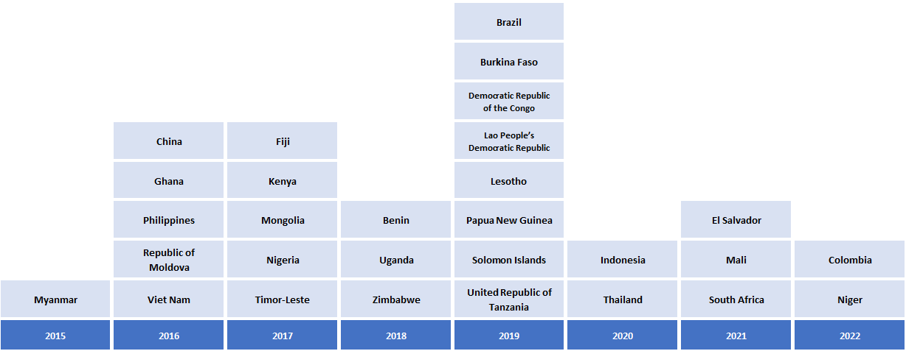
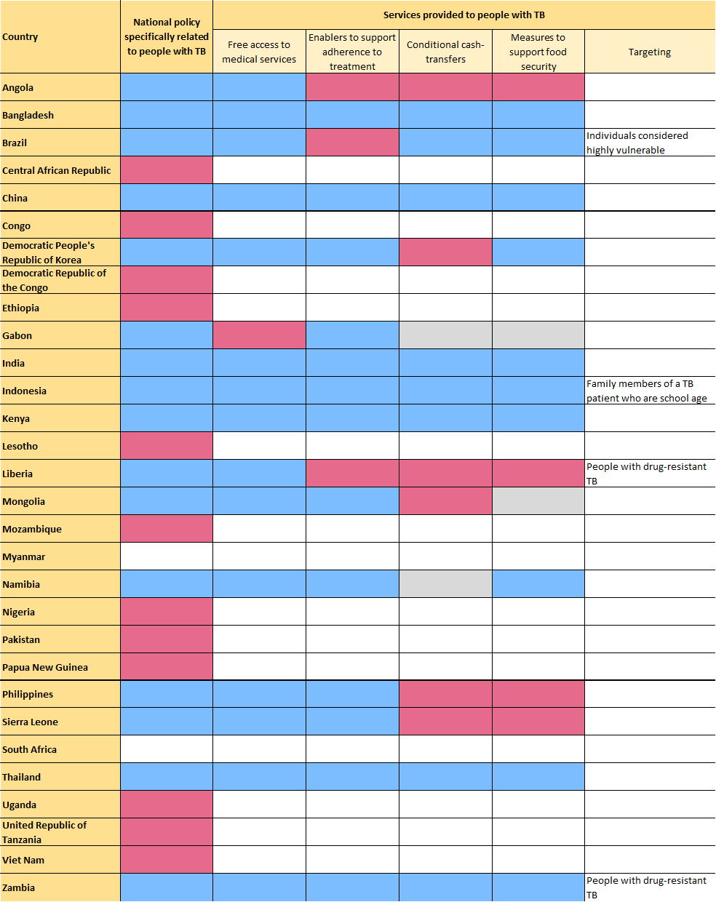

```{r setup, include=FALSE}
# Load output packages ----
# - - - - - - - - - - - - - - - - - - - - - - - - - - - - - - - - - -
library(ggplot2)
library(dplyr)
library(scales)
library(RColorBrewer)
library(whomap)
library(gtbreport)
library(here)
library(Cairo)
library(cowplot)

# Get the data sets and computed values/statistics for section 6.1 ----
# - - - - - - - - - - - - - - - - - - - - - - - - - - - - - - - - - - - 
source(here('report/ch6-2_prepare_data.r'))

# Save PDF
save_pdf = FALSE

```

```{r setup2, include=FALSE}
# Chapter 1
# Set options, load data, utility functions
knitr::opts_chunk$set(echo = FALSE,
                      results = "asis",
                      message = FALSE,
                      warning = FALSE)


# Quick functions for callouts in the text to the figures/tables:
# 1. lnk() Creates a link from text to a named anchor)
lnk <- function(display_name){
  return(paste0('<span class="red">[',
                display_name,
                '](#',
                gsub("[^a-zA-Z0-9]", "-", tolower(display_name)),
                ')</span>'))
}

# 2. anch() creates the named anchor to go above the figure or table
anch <- function(display_name){
  return(paste0('<a name="',
                gsub("[^a-zA-Z0-9]", "-", tolower(display_name)),
                '"></a>'))
}


# 3. ref_lnk() creates a link from text to the references in the WHO style (black, italic)
ref_lnk <- function(display_name){
  return(paste0('<span class="refs">[', 
                display_name, 
                '](#refs)</span>'))
}
```

```{css, echo=FALSE}
/* Styles to make it easier to see in the html_fragment; this CSS can be included in the CSS widget of Sitefinity */
  
  
.subhead, .footnote {
  font-size: 80%;
  line-height: 100%;
  font-weight: normal;
  margin: 0;
  padding: 0;
}

.subhead {
  margin-top: -15px; /* Bring subheadings closer to figure headings */
}

.red, .red a {
  color: #F21905; /* red text to show figure number */
}

.refs, .refs a {
  color: #3c4245;  /* match SF normal text colour */
  font-style: italic;
}

```

# 6.2 National surveys of costs faced by TB patients and their households   

_Draft! Prepared `r Sys.Date()` using country-reported data CSV files dated `r csv_datestamp`_  

The World Health Organization (WHO) End TB Strategy includes the target that no tuberculosis (TB) patients and their households face catastrophic total costs because of TB disease. Total costs are defined as the sum of direct medical expenditures, direct nonmedical expenditures and indirect costs (e.g. income losses). This target was set because everyone who develops TB disease needs to be able to access diagnosis and treatment, and if this is not ensured the End TB Strategy targets for reductions in TB disease burden (incidence and mortality) will not be achieved.

WHO has established standard methods for conducting a national survey to assess the direct and indirect costs incurred by people with TB and their households (TB patient cost surveys) (`r ref_lnk("1")`). Since 2015, there has been substantial progress in the planning and implementation of national TB patient cost surveys (`r lnk("Fig. 6.2.1")`). 

### `r anch("Fig. 6.2.1")`<span class="red">Fig. 6.2.1</span> National surveys of costs faced by TB patients and their households since 2015: progress and plans (as of September `r report_year`)

```{r fig_6.2.1,fig.alt="National surveys of costs faced by TB patients and their households since 2016: progress and plans"}

f6.2.1_data %>%
  whomap(colours = palatte_fig6.2.1,
         legend.title = "Status",
         na.col = "white", water.col = "white",
#         na.label = "Not planned",
         legend.pos = c(0.14,0.40))

```
<div class="footnote">Source: WHO Global TB Programme</div>


<br />
By September `r report_year`, 29 countries had completed a survey (`r lnk("Fig. 6.2.2")`). 

### `r anch("Fig. 6.2.2")`<span class="red">Fig. 6.2.2</span> Timeline of national TB patient cost surveys implemented since 2015 (as of September `r report_year`)

```{r fig_6.2.2,fig.alt="Timeline of national TB patient cost surveys implemented since 2015", out.width = '100%'}



```


<br />
In the `r nrow(f6.2.3a_txt_num)` surveys for which results have been reported, the percentage of TB patients and their households that experienced catastrophic total costs (defined as >20% of household expenditure or income) ranged from `r ftb(f6.2.3a_txt_lo$catast_pct)`% (95% confidence interval [CI]: `r ftb(f6.2.3a_txt_lo$catast_pct_lo)`–`r ftb(f6.2.3a_txt_lo$catast_pct_hi)`%) in `r f6.2.3a_txt_lo$country` to `r ftb(f6.2.3a_txt_hi$catast_pct)`% (95% CI: `r ftb(f6.2.3a_txt_hi$catast_pct_lo)`–`r ftb(f6.2.3a_txt_hi$catast_pct_hi)`%) in `r f6.2.3a_txt_hi$country` (`r lnk("Fig. 6.2.3")`). The pooled average for all `r nrow(f6.2.3a_txt_num)` countries, weighted for each country’s number of notified cases, was `r ftb(f6.2.3a_txt$catast_pct)`% (95% CI: `r ftb(f6.2.3a_txt$catast_pct_lo)`–`r ftb(f6.2.3a_txt$catast_pct_hi)`%). Among `r nrow(f6.2.3c_txt_num)` countries that reported disaggregated data, the percentage facing catastrophic total costs was much higher for people with drug-resistant TB (DR-TB), with a pooled average of `r ftb(f6.2.3c_txt$catast_pct)`% (95% CI: `r ftb(f6.2.3c_txt$catast_pct_lo)`–`r ftb(f6.2.3c_txt$catast_pct_hi)`%).

### `r anch("Fig. 6.2.3")`<span class="red">Fig. 6.2.3</span> Estimates of the percentage of TB patients and their households facing catastrophic costs,^a^ national surveys completed 2016&#8211;`r report_year` 

```{r fig_6.2.3,fig.dim = c(12, 14),fig.alt="Forest plot to show selected baseline results from national surveys of costs faced by TB patients and their households"}

f6.2.3a_plot <- 
  f6.2.3a_data  %>% 
  mutate(country = factor(country, levels = f6.2.3_sel_order$country_a, ordered = TRUE)) %>% 
  ggplot(aes(y = country, x = catast_pct, group=grp))+
  geom_point(aes(col=grp,shape=grp,size=grp))+
  geom_errorbar(aes(xmin=catast_pct_lo, xmax=catast_pct_hi,col=grp), width=0.5,cex=1) +
  xlim(0,100) + xlab(bquote('Percentage')) + ylab(NULL) +
  annotate("text", x = 0, y = nrow(f6.2.3a_data)+1.5, label = "All TB", cex=5,hjust = 0)+
  coord_cartesian(clip = 'off') +
  scale_color_manual(values=c("darkblue","dodgerblue3")) +
  scale_shape_manual(values=c(18,20)) +
  scale_size_manual(values=c(5,4)) +
  theme_gtb() + theme(legend.position = "none") +
  theme(axis.title.x = element_text(face = 'bold',size=12)) +
  theme(axis.text.x  = element_text(face = 'plain',size=12)) +
  theme(axis.text.y  = element_text(face = c('bold',rep('plain',nrow(f6.2.3a_data)-1)),size=12))


f6.2.3b_plot <- 
  f6.2.3b_data  %>% 
  mutate(country = factor(country, levels = f6.2.3_sel_order$country, ordered = TRUE)) %>% 
  ggplot(aes(y = country, x = catast_pct, group=grp))+
  geom_point(aes(col=grp,shape=grp,size=grp))+
  geom_errorbar(aes(xmin=catast_pct_lo, xmax=catast_pct_hi,col=grp), width=0.5,cex=1) +
  xlim(0,100) + xlab("Percentage") + ylab(NULL) +
  annotate("text", x = 0, y = nrow(f6.2.3b_data)+1.5, label = bquote('TB (first-line treatment)'^'b'), cex=5,hjust = 0)+
  coord_cartesian(clip = 'off') +
  scale_color_manual(values=c("green4","seagreen3")) +
  scale_shape_manual(values=c(18,20)) +
  scale_size_manual(values=c(5,4)) +
  theme_gtb() +
  theme(legend.position = "none") +
  theme(axis.title.x = element_text(face = 'bold',size=12)) +
  theme(axis.text.x  = element_text(face = 'plain',size=12)) +
  theme(axis.text.y  = element_text(face = c('bold',rep('plain',nrow(f6.2.3b_data)-1)),size=12))

f6.2.3c_plot <- 
  f6.2.3c_data  %>% 
  mutate(country = factor(country, levels = f6.2.3_sel_order$country, ordered = TRUE)) %>% 
  ggplot(aes(y = country, x = catast_pct, group=grp))+
  geom_point(aes(col=grp,shape=grp,size=grp))+
  geom_errorbar(aes(xmin=catast_pct_lo, xmax=catast_pct_hi,col=grp), width=0.5,cex=1) +
  geom_text(aes(label="NA",x=96,y=2),vjust=0.5,hjust=-0,col="grey45",size=4)+
  geom_text(aes(label="NA",x=96,y=9),vjust=0.5,hjust=-0,col="grey45",size=4)+
  geom_text(aes(label="NA",x=96,y=27),vjust=0.5,hjust=-0,col="grey45",size=4)+
  geom_text(aes(label="NA",x=96,y=28),vjust=0.5,hjust=-0,col="grey45",size=4)+
  xlim(0,100) + xlab("Percentage") + ylab(NULL) +
  annotate("text", x = 0, y = nrow(f6.2.3c_data)+1.5, label = bquote('Drug-resistant'~'TB'^'b'), cex=5,hjust = 0)+
  coord_cartesian(clip = 'off') +
  scale_color_manual(values=c("firebrick4","firebrick3")) +
  scale_shape_manual(values=c(18,20)) +
  scale_size_manual(values=c(5,4)) +
  theme_gtb() +
  theme(legend.position = "none") +
  theme(axis.title.x = element_text(face = 'bold',size=12)) +
  theme(axis.text.x  = element_text(face = 'plain',size=12)) +
  theme(axis.text.y  = element_text(face = c('bold',rep('plain',nrow(f6.2.3c_data)-1)),size=12))

aligned_plots <- align_plots(f6.2.3a_plot,f6.2.3b_plot,f6.2.3c_plot, align="hv", axis="tblr") 
f6.2.3_plot <- ggdraw() +
  draw_plot(f6.2.3a_plot, x=0,   y=0.5, width=1, height=0.5) +
  draw_plot(f6.2.3b_plot, x=0,   y=0, width=0.5, height=0.5) +
  draw_plot(f6.2.3c_plot, x=0.5, y=0, width=0.5, height=0.5) 
f6.2.3_plot


```
<div id="fig_6_2_3a"></div>

<div class="row">
<div class="col-md-6">
<div id="fig_6_2_3b"></div>
</div>
<div class="col-md-6">
<div id="fig_6_2_3c"></div>
</div>
</div>

<div class="footnote">NA - not available.<br />^a^ Defined as direct medical expenditures, direct nonmedical expenditures and indirect costs (e.g. income losses) that sum to >20% of household income. This indicator is not the same as the SDG indicator for catastrophic health expenditures.<br />^b^ Disaggregated estimates for TB (first-line treatment) and drug-resistant TB were available for only `r nrow(f6.2.3c_txt_num)` countries. The calculation of confidence intervals for Mali and Uganda did not account for sampling design.<br />^c^ Since 95% confidence intervals were not included in the national survey report, simple binomial confidence intervals were calculated based on the survey sample size.<br /><br />Source: WHO Global TB Programme</div>


```{r fig_6.2.3_2, eval=FALSE, fig.dim=c(12, 4), include=FALSE}

# previously used for donuts chart - removed from 2022 report
f6.2.3_2_plot <- f6.2.3_text  %>% 
  ggplot(aes(x = grp, y = catast_pct, group=grp))+
  geom_point(aes(col=grp),position=position_dodge(width=0.5))+
  geom_errorbar(aes(ymin=catast_pct_lo, ymax=catast_pct_hi,col=grp),
                width=0.15,cex=0.7,position=position_dodge(width=0.5))+ 
  xlab(NULL) + 
  ylab("Percentage (95% CI)") + ylim(0,100)+
  geom_text(aes(label=paste(round(catast_pct, digits=0))), vjust=-1.5, color="black", size=3.5) +
  theme(legend.position = "none")+
  scale_color_manual(name = NULL, values=c("firebrick2","green4","blue")#,labels = c("Overall","DR-TB","DS-TB")
  ) + 
  coord_flip()

f6.2.3_2_plot <- f6.2.3_2_plot + theme_gtb()+theme(legend.position = "none")
f6.2.3_2_plot


```


<br />
The distribution of costs faced by TB patients and their households varies among countries (`r lnk("Fig. 6.2.4")`). However, it was evident that – despite the widespread norm of “free TB care” policies – TB-affected households still face direct medical costs. Such costs accounted for a sizeable proportion of total costs in some countries (e.g. `r sub("Democratic", "the Democratic", knitr::combine_words(f6.2.4_txt_med$country, oxford_comma=FALSE))`). Minimizing direct medical costs borne by TB patients should be a high priority for national TB programmes (NTPs) and ministries of health.

### `r anch("Fig. 6.2.4")`<span class="red">Fig. 6.2.4</span> Distribution of costs faced by TB patients and their households in national surveys^a^ completed 2016&#8211;`r report_year`  

```{r fig_6.2.4,fig.dim = c(12, 7)}

f6.2.4_plot <- f6.2.4_data %>% 
  # pivot_longer(p_med:p_indirect,names_to="cat") %>% 
  mutate(country = factor(country, levels = f6.2.4_sel_order$country, ordered = TRUE)) %>% 
  mutate(cat=factor(cat,levels=c("p_indirect","p_nmed","p_med"))) %>%
  ggplot(aes(fill=cat, y=value, x=country)) + 
  geom_bar(stat="identity", position="fill") +
  scale_fill_manual(name = NULL,
                      labels = c("Indirect","Direct, nonmedical","Direct, medical"),
                      values = palatte_f6.2.4,
                      guide = guide_legend(reverse=TRUE))+
  theme_gtb() + theme(legend.position = "bottom") +
  theme(
    axis.line.y=element_blank(),
    axis.text.y=element_text(size=12,face="plain"))+
  xlab("")+
  scale_y_continuous(name ="Cost breakdown (%)",
                     labels = scales::percent_format(accuracy = 1))+
  coord_flip()

f6.2.4_plot


```
<div id="fig_6_2_4"></div>
<div class="footnote">^a^ The distributions are based on `r nrow(f6.2.4_txt_num)` country surveys that have been completed and the data were reported. Data are not available for Benin.<br />Source: WHO Global TB Programme</div>


<br />
The surveys also showed that actions are needed to eliminate direct nonmedical costs and to reduce indirect costs. The combined cost of transportation, food, nutritional supplements and other nonmedical expenditures (“direct nonmedical costs”) accounted for a substantial share (50% or more) of total costs in some countries, including `r gsub("(Philip)|(Democratic)|(United)", "the \\1\\2\\3", knitr::combine_words(f6.2.4_txt_nmed$country, oxford_comma=FALSE))`. Indirect costs associated with loss of employment or time lost while seeking or staying in care accounted for the largest single share of total costs in `r gsub("(Philip)|(Democratic)|(Russian)", "the \\1\\2\\3", knitr::combine_words(f6.2.4_txt_indirect$country, oxford_comma=FALSE))`.

All cost categories are influenced by the model of TB care; for example, to what extent there is reliance on hospitalization or outpatient care, the frequency with which attendance at health facilities is requested and the level to which services are decentralized to bring the services close to the community. They are also influenced by ease of access to the health facilities used to provide care.

Social protection is required to mitigate or eliminate direct nonmedical costs and indirect costs. Only 16 of the 30 high TB burden countries have a national policy that is specifically related to social protection for people with TB (`r lnk("Table 6.2.1")`). Free access to medical services is the most commonly-used measure (15/16 countries); at least one other form of social protection (such as cash transfers, enablers to adhere to treatment, support to help with food security) is provided in 14 countries. 

### `r anch("Table 6.2.1")`<span class="red">Table 6.2.1</span> Status of social protection for people with TB, 30 high TB burden countries 
<div class="subhead"><span style="color:#3399FF">Blue</span> indicates that a policy or specific measure is in place, <span class="red">red</span> indicates that a policy or specific measure is not in place, <span style="color:#666699">grey</span> a policy or specific measure has not been identified, and blank indicates no data.</div> 


```{r tab_6.2.1, out.width = '100%'}



```
<div class="footnote">Source: WHO Global TB Programme</div>


<br />
Comprehensive documentation about the 20 national surveys completed between 2015 and 2021 that used WHO-recommended methods and for which results have been shared with WHO are available in a book published by WHO in 2022 (`r ref_lnk("2")`). This includes cross-cutting chapters on methods, results, policy implications and future direction, and profiles for each national survey in a standardized format.


`r anch("refs")`

<hr style="border:1px solid gray20">

**References**

<div class="footnote">

1. Tuberculosis patient cost surveys: a handbook. Geneva: World Health Organization; 2017 (https://www.who.int/publications/i/item/9789241513524).
  
2. National surveys of costs faced by TB patients and their households, 2015–2021. Geneva: World Health Organization; in press.
  
</div>


```{r eval=save_pdf, include=F}
# this section is for saving .pdf and .csv for graphic design for PDF report - not web version!

# fig 35
f6.2.3a_data %>% write_csv(here("./report/pdf/fig35a.csv"))   # write csv for Sue
f6.2.3c_data %>% write_csv(here("./report/pdf/fig35b.csv"))   # write csv for Sue
CairoPDF(here('report/pdf/fig35.pdf'), #plot=f6.2.3_plot, 
         width=12, height=15)
f6.2.3_plot
dev.off()
```

